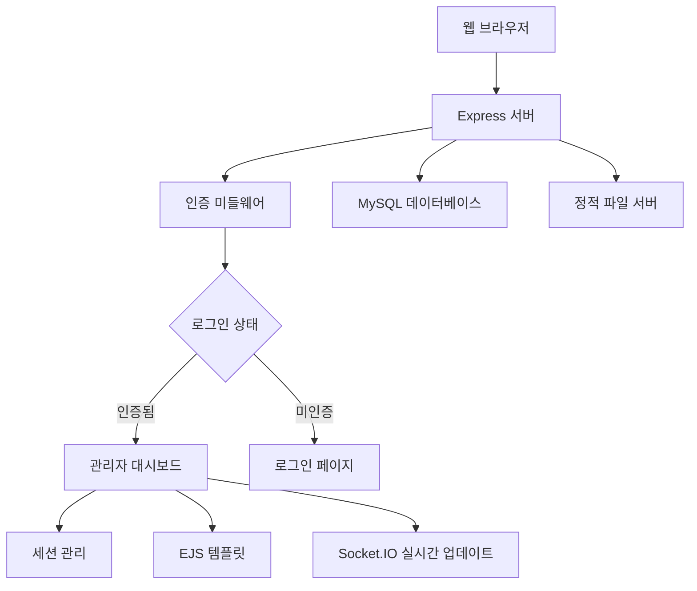
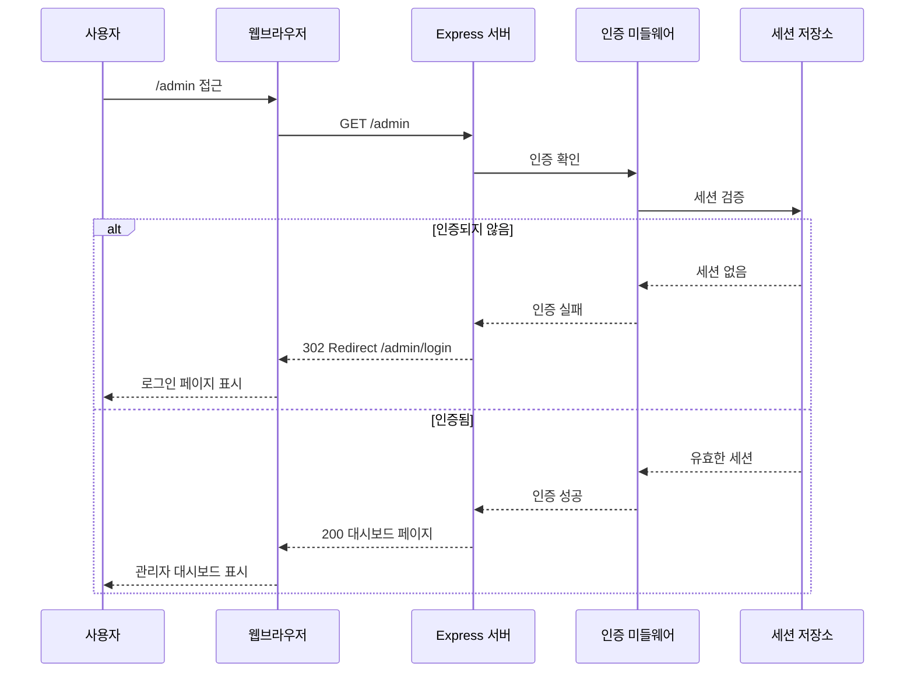
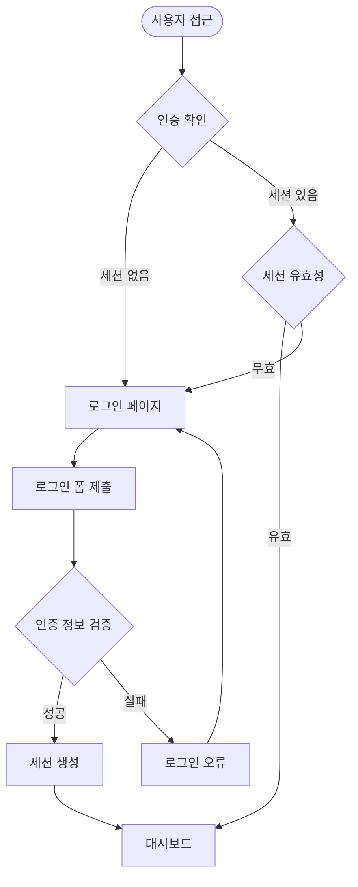

# AIOSK 관리자 페이지 접근 및 인증 가이드

## 📋 목차

- [개요](#개요)
- [시스템 아키텍처](#시스템-아키텍처)
- [접근 방법](#접근-방법)
- [인증 시스템](#인증-시스템)
- [문제 해결](#문제-해결)
- [보안 설정](#보안-설정)

---

## 📖 개요

AIOSK 관리자 페이지는 키오스크 시스템의 전체적인 관리와 모니터링을 위한 웹 기반 인터페이스입니다.

### 🎯 주요 기능

- **대시보드**: 실시간 매출, 주문 현황, 통계 정보
- **주문 관리**: 주문 조회, 상태 변경, 히스토리 관리
- **메뉴 관리**: 메뉴 등록, 수정, 삭제, 카테고리 관리
- **통계 및 리포트**: 매출 분석, 인기 메뉴, 시간대별 분석
- **키오스크 모니터링**: 실시간 키오스크 상태 모니터링
- **시스템 설정**: 전체 시스템 설정 및 구성

---

## 🏗️ 시스템 아키텍처



### 📂 디렉토리 구조

```
src/
├── controllers/
│   └── webAdmin.controller.js     # 관리자 페이지 컨트롤러
├── routes/
│   └── webAdmin.routes.js         # 관리자 페이지 라우팅
├── views/
│   ├── layouts/
│   │   └── admin.ejs              # 관리자 페이지 레이아웃
│   ├── admin/
│   │   ├── login.ejs              # 로그인 페이지
│   │   ├── dashboard.ejs          # 대시보드
│   │   ├── orders.ejs             # 주문 관리
│   │   ├── menus.ejs              # 메뉴 관리
│   │   ├── categories.ejs         # 카테고리 관리
│   │   ├── statistics.ejs         # 통계 페이지
│   │   ├── kiosk-monitor.ejs      # 키오스크 모니터링
│   │   └── settings.ejs           # 시스템 설정
│   └── partials/
│       ├── navbar.ejs             # 네비게이션 바
│       ├── sidebar.ejs            # 사이드바
│       └── footer.ejs             # 푸터
└── public/
    ├── css/
    │   └── admin.css              # 관리자 페이지 스타일
    └── js/
        └── admin.js               # 관리자 페이지 스크립트
```

---

## 🔗 접근 방법

### 1. 기본 URL 구조

```
http://localhost:[PORT]/admin
```

### 2. 주요 엔드포인트

| 엔드포인트             | 설명                   | 인증 필요 |
| ---------------------- | ---------------------- | --------- |
| `/admin`               | 관리자 대시보드 (루트) | ✅        |
| `/admin/login`         | 로그인 페이지          | ❌        |
| `/admin/logout`        | 로그아웃               | ❌        |
| `/admin/dashboard`     | 대시보드 (리다이렉트)  | ✅        |
| `/admin/orders`        | 주문 관리              | ✅        |
| `/admin/menus`         | 메뉴 관리              | ✅        |
| `/admin/categories`    | 카테고리 관리          | ✅        |
| `/admin/statistics`    | 통계 및 리포트         | ✅        |
| `/admin/kiosk-monitor` | 키오스크 모니터링      | ✅        |
| `/admin/settings`      | 시스템 설정            | ✅        |

### 3. 접근 시나리오



---

## 🔐 인증 시스템

### 1. 세션 기반 인증

AIOSK는 Express Session을 사용한 서버 사이드 세션 관리를 구현합니다.

```javascript
// 세션 설정 예시
app.use(
  session({
    secret: process.env.SESSION_SECRET || "aiosk-admin-secret-key",
    resave: false,
    saveUninitialized: false,
    cookie: {
      secure: false, // HTTPS에서는 true로 설정
      maxAge: 24 * 60 * 60 * 1000, // 24시간
    },
  })
);
```

### 2. 인증 플로우



### 3. 기본 로그인 정보

```
사용자명: admin
비밀번호: admin123
```

⚠️ **보안 경고**: 운영 환경에서는 반드시 강력한 비밀번호로 변경하세요.

### 4. 인증 미들웨어

```javascript
const requireAuth = (req, res, next) => {
  const sessionId = req.session?.adminId;
  if (!sessionId || !sessions.has(sessionId)) {
    req.flash("error", "로그인이 필요합니다.");
    return res.redirect("/admin/login");
  }
  req.admin = sessions.get(sessionId);
  next();
};
```

---

## 🛠️ 문제 해결

### 1. 404 오류 해결

#### 문제: `/admin` 접근 시 404 오류

**원인**: 라우터 설정 문제 또는 서버 미실행

**해결 방법**:

1. 서버 실행 상태 확인

   ```bash
   ps aux | grep node
   netstat -tulpn | grep :3003
   ```

2. 라우터 등록 확인

   ```javascript
   // server.js에서 확인
   app.use("/admin", webAdminRoutes);
   ```

3. 포트 충돌 해결
   ```bash
   # 다른 포트에서 실행
   PORT=3004 node src/server.js
   ```

#### 문제: 로그인 페이지 접근 불가

**원인**: 뷰 파일 누락 또는 경로 문제

**해결 방법**:

1. 뷰 파일 존재 확인

   ```bash
   ls -la src/views/admin/login.ejs
   ```

2. EJS 설정 확인
   ```javascript
   app.set("view engine", "ejs");
   app.set("views", path.join(__dirname, "views"));
   ```

### 2. 인증 문제 해결

#### 문제: 로그인 후에도 로그인 페이지로 리다이렉트

**원인**: 세션 저장 또는 검증 문제

**해결 방법**:

1. 세션 설정 확인
2. 브라우저 쿠키 확인
3. 서버 로그 확인

#### 문제: 세션 만료 문제

**원인**: 세션 타임아웃 설정

**해결 방법**:

```javascript
// 세션 만료 시간 조정
cookie: {
  maxAge: 8 * 60 * 60 * 1000;
} // 8시간
```

### 3. 포트 충돌 해결

```bash
# 사용 중인 포트 확인
netstat -tulpn | grep :3000

# 프로세스 종료
pkill -f "node src/server.js"

# 다른 포트에서 실행
PORT=3005 node src/server.js
```

### 4. 디버깅 방법

#### 서버 로그 확인

```bash
# 실시간 로그 확인
tail -f logs/app.log

# 특정 패턴 검색
grep "인증" logs/app.log
```

#### 브라우저 개발자 도구

1. **Network 탭**: HTTP 요청/응답 확인
2. **Console 탭**: JavaScript 오류 확인
3. **Application 탭**: 쿠키 및 세션 스토리지 확인

---

## 🔒 보안 설정

### 1. 세션 보안

```javascript
app.use(
  session({
    secret: process.env.SESSION_SECRET, // 강력한 시크릿 키
    resave: false,
    saveUninitialized: false,
    cookie: {
      secure: true, // HTTPS 환경에서만
      httpOnly: true, // XSS 공격 방지
      maxAge: 8 * 60 * 60 * 1000, // 8시간
      sameSite: "strict", // CSRF 공격 방지
    },
  })
);
```

### 2. 비밀번호 보안

```javascript
// bcrypt를 사용한 비밀번호 해싱 (권장)
const bcrypt = require("bcrypt");

const hashPassword = async (password) => {
  return await bcrypt.hash(password, 12);
};

const verifyPassword = async (password, hashedPassword) => {
  return await bcrypt.compare(password, hashedPassword);
};
```

### 3. 접근 제한

```javascript
// IP 기반 접근 제한
const allowedIPs = ["127.0.0.1", "192.168.1.0/24"];

const ipFilter = (req, res, next) => {
  const clientIP = req.ip || req.connection.remoteAddress;
  if (allowedIPs.includes(clientIP)) {
    next();
  } else {
    res.status(403).send("Access Denied");
  }
};

app.use("/admin", ipFilter);
```

### 4. 로그인 시도 제한

```javascript
const loginAttempts = new Map();

const rateLimiter = (req, res, next) => {
  const ip = req.ip;
  const attempts = loginAttempts.get(ip) || 0;

  if (attempts >= 5) {
    return res.status(429).json({
      error: "너무 많은 로그인 시도입니다. 잠시 후 다시 시도하세요.",
    });
  }

  next();
};
```

---

## 📊 모니터링 및 로깅

### 1. 접근 로그

```javascript
// 관리자 페이지 접근 로깅
router.use((req, res, next) => {
  console.log(
    `[${new Date().toISOString()}] 관리자 페이지 접근: ${req.method} ${
      req.path
    } - IP: ${req.ip}`
  );
  next();
});
```

### 2. 실시간 모니터링

```javascript
// Socket.IO를 통한 실시간 알림
io.on("connection", (socket) => {
  socket.join("admin-room");

  // 새로운 주문 알림
  socket.on("newOrder", (orderData) => {
    io.to("admin-room").emit("orderNotification", orderData);
  });
});
```

---

## 🚀 향후 개선 사항

### 1. 고급 인증

- [ ] 2단계 인증 (2FA)
- [ ] JWT 토큰 기반 인증
- [ ] OAuth 2.0 연동

### 2. 권한 관리

- [ ] 역할 기반 접근 제어 (RBAC)
- [ ] 세분화된 권한 설정
- [ ] 사용자 그룹 관리

### 3. 보안 강화

- [ ] HTTPS 강제 적용
- [ ] CSP (Content Security Policy)
- [ ] 보안 헤더 설정

### 4. 사용자 경험 개선

- [ ] 다크 테마 지원
- [ ] 반응형 디자인 최적화
- [ ] PWA (Progressive Web App) 지원

---

## 📞 지원 및 문의

문제가 지속되거나 추가 지원이 필요한 경우:

1. **GitHub Issues**: 버그 리포트 및 기능 요청
2. **Documentation**: 상세한 API 문서 참조
3. **Community**: 개발자 커뮤니티 참여

---

_이 가이드는 AIOSK v1.0.0 기준으로 작성되었습니다. 최신 버전의 변경사항은 공식 문서를 참조하세요._
