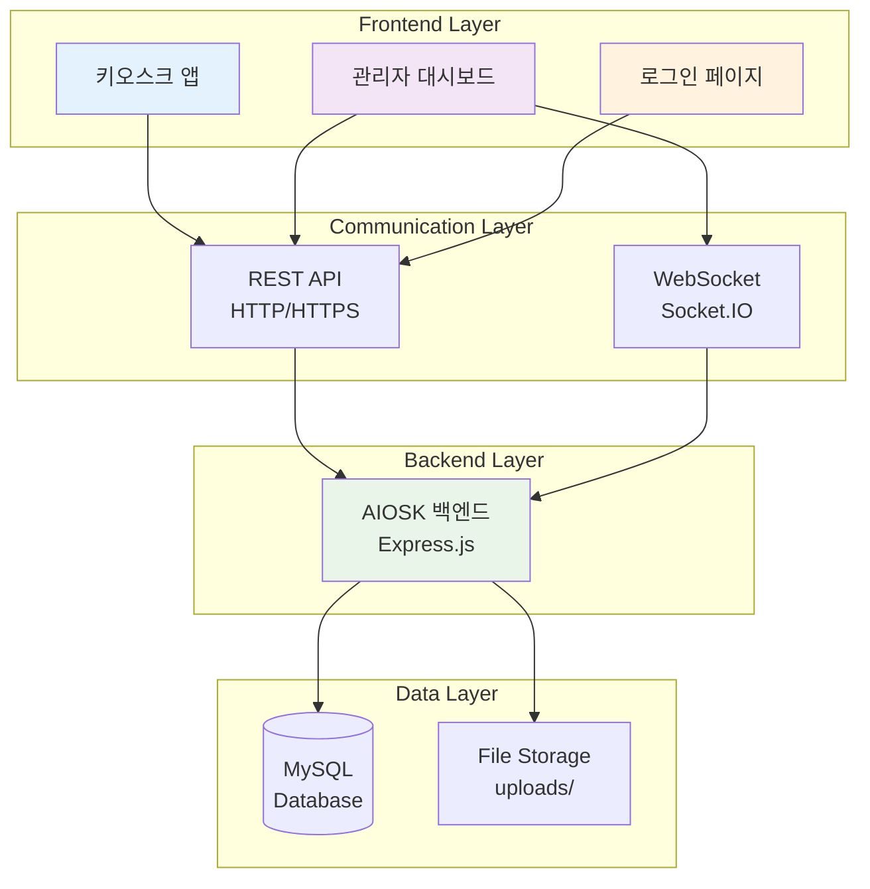
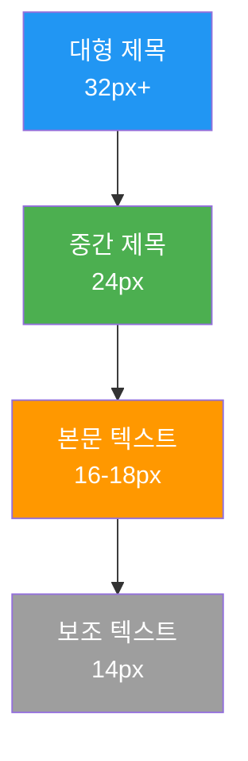
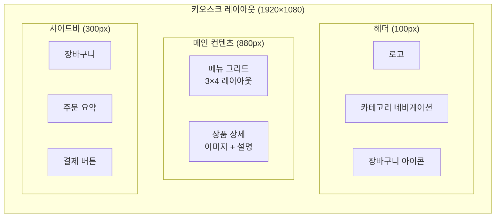
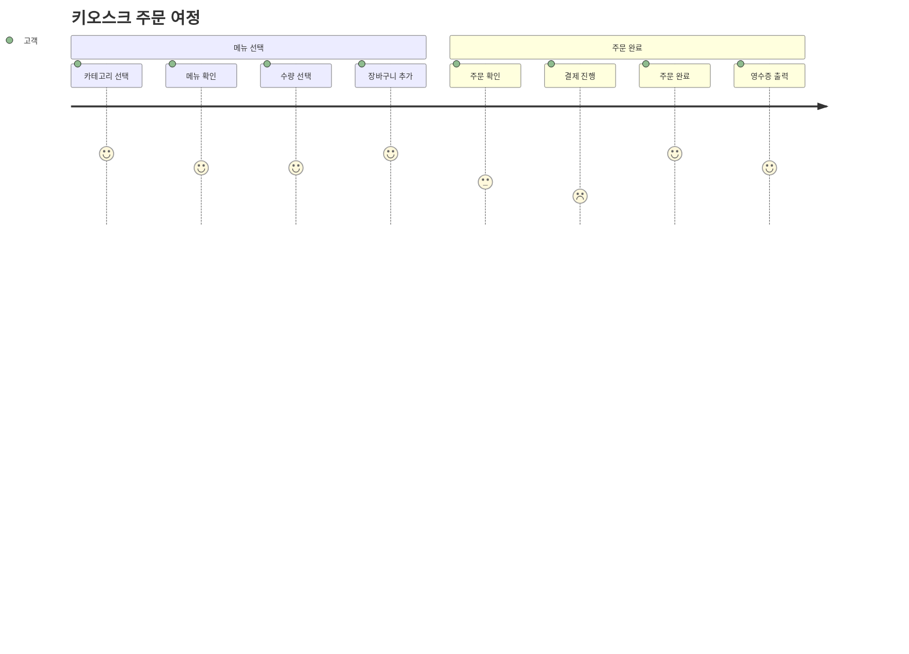
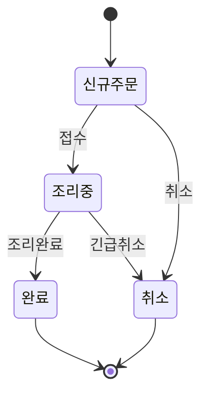
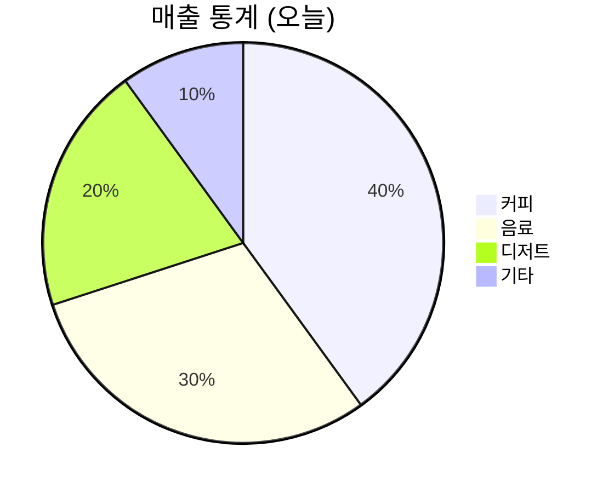

# 🎨 AIOSK 프론트엔드 개발 계획서

> **프로젝트**: AIOSK 키오스크 시스템 프론트엔드  
> **작성일**: 2025년 6월 24일  
> **목표**: 사용자 친화적인 키오스크 인터페이스 개발

---

## 📋 목차

- [🎯 개발 목표](#-개발-목표)
- [🏗️ 시스템 아키텍처](#️-시스템-아키텍처)
- [🎨 UI/UX 설계](#-uiux-설계)
- [🛠️ 기술 스택](#️-기술-스택)
- [📱 화면 구성](#-화면-구성)
- [🔄 개발 단계](#-개발-단계)

---

## 🎯 개발 목표

### 📱 **키오스크 사용자 인터페이스**

- 직관적이고 터치 친화적인 대형 화면 UI
- 빠른 주문 처리 및 결제 흐름
- 접근성을 고려한 사용자 경험

### 👥 **관리자 대시보드**

- 실시간 주문 모니터링
- 메뉴 및 카테고리 관리
- 매출 통계 및 분석

### 🔧 **시스템 요구사항**

- 반응형 웹 디자인
- 실시간 데이터 업데이트
- 오프라인 모드 지원 (향후)

---

## 🏗️ 시스템 아키텍처



---

## 🎨 UI/UX 설계

### 🎨 **디자인 원칙**

#### 1. **터치 최적화**

- **버튼 크기**: 최소 44px × 44px (터치 표준)
- **간격**: 버튼 간 최소 8px 여백
- **제스처**: 탭, 스와이프, 핀치 줌 지원

#### 2. **시각적 계층**



#### 3. **컬러 팔레트**

- **주요 색상**: #2196F3 (파란색)
- **보조 색상**: #4CAF50 (초록색)
- **강조 색상**: #FF9800 (주황색)
- **배경**: #FAFAFA (연한 회색)
- **텍스트**: #212121 (진한 회색)

### 🖼️ **레이아웃 설계**

#### 키오스크 화면 (터치스크린 최적화)



---

## 🛠️ 기술 스택

### 🎨 **프론트엔드 Framework**

- **React.js 18+**: 컴포넌트 기반 UI 개발
- **TypeScript**: 타입 안전성 보장
- **Vite**: 빠른 번들링 및 개발 서버

### 🎯 **상태 관리**

- **Redux Toolkit**: 전역 상태 관리
- **React Query**: 서버 상태 관리 및 캐싱

### 🎨 **UI 라이브러리**

- **Material-UI (MUI)**: 컴포넌트 라이브러리
- **Styled-Components**: CSS-in-JS 스타일링
- **Framer Motion**: 애니메이션 효과

### 📡 **통신**

- **Axios**: HTTP 클라이언트
- **Socket.IO Client**: 실시간 통신

### 🧪 **개발 도구**

- **ESLint + Prettier**: 코드 품질 관리
- **React Testing Library**: 컴포넌트 테스트
- **Storybook**: 컴포넌트 문서화

---

## 📱 화면 구성

### 🍽️ **키오스크 앱 (고객용)**

#### 1. **메인 화면**



- **카테고리 네비게이션**: 커피, 음료, 디저트 등
- **메뉴 그리드**: 이미지 + 이름 + 가격
- **장바구니**: 실시간 업데이트
- **검색 기능**: 메뉴명 검색

#### 2. **메뉴 상세 화면**

- **대형 이미지**: 고해상도 메뉴 사진
- **상세 정보**: 설명, 영양성분, 알레르기 정보
- **옵션 선택**: 사이즈, 토핑, 온도 등
- **수량 조절**: +/- 버튼

#### 3. **장바구니 & 결제**

- **주문 요약**: 선택 메뉴 + 총 금액
- **수정/삭제**: 주문 내역 편집
- **결제 방식**: 카드, 현금, 모바일 페이
- **영수증 옵션**: 출력 여부 선택

### 👨‍💼 **관리자 대시보드**

#### 1. **로그인 화면**

- **인증**: JWT 토큰 기반 로그인
- **보안**: 이중 인증 (향후)

#### 2. **실시간 주문 모니터링**



- **주문 큐**: 실시간 주문 리스트
- **상태 관리**: 접수 → 조리중 → 완료
- **알림**: Socket.IO 기반 실시간 알림

#### 3. **메뉴 관리**

- **CRUD 작업**: 메뉴 생성, 수정, 삭제
- **이미지 업로드**: 드래그 앤 드롭 업로드
- **카테고리 관리**: 순서 조정 가능

#### 4. **통계 대시보드**



- **매출 차트**: 일별, 주별, 월별
- **인기 메뉴**: TOP 10 베스트셀러
- **고객 분석**: 주문 패턴 분석

---

## 🔄 개발 단계

### 📅 **Phase 1: 기본 구조 (1주)**

- [x] 프로젝트 셋업 (React + TypeScript + Vite)
- [x] 기본 라우팅 구조
- [x] UI 컴포넌트 라이브러리 설정
- [x] API 클라이언트 설정

### 📅 **Phase 2: 키오스크 UI (2주)**

- [ ] 메인 화면 레이아웃
- [ ] 카테고리 네비게이션
- [ ] 메뉴 그리드 컴포넌트
- [ ] 장바구니 기능

### 📅 **Phase 3: 주문 시스템 (1주)**

- [ ] 주문 생성 플로우
- [ ] 결제 인터페이스
- [ ] 주문 완료 화면

### 📅 **Phase 4: 관리자 대시보드 (2주)**

- [ ] 로그인 시스템
- [ ] 실시간 주문 모니터링
- [ ] 메뉴 관리 CRUD
- [ ] 통계 대시보드

### 📅 **Phase 5: 고급 기능 (1주)**

- [ ] 실시간 알림 (Socket.IO)
- [ ] 반응형 디자인
- [ ] 성능 최적화
- [ ] 접근성 개선

### 📅 **Phase 6: 테스트 & 배포 (1주)**

- [ ] 단위 테스트
- [ ] 통합 테스트
- [ ] E2E 테스트
- [ ] 프로덕션 빌드 & 배포

---

## 🎨 **컴포넌트 설계**

### 🧩 **공통 컴포넌트**

```
components/
├── ui/
│   ├── Button/
│   ├── Card/
│   ├── Modal/
│   ├── Input/
│   └── Loading/
├── layout/
│   ├── Header/
│   ├── Navigation/
│   ├── Sidebar/
│   └── Footer/
└── forms/
    ├── LoginForm/
    ├── MenuForm/
    └── OrderForm/
```

### 🍽️ **키오스크 컴포넌트**

```
kiosk/
├── CategoryNav/
├── MenuGrid/
├── MenuCard/
├── MenuDetail/
├── ShoppingCart/
├── OrderSummary/
└── PaymentForm/
```

### 👨‍💼 **관리자 컴포넌트**

```
admin/
├── Dashboard/
├── OrderQueue/
├── MenuManager/
├── StatisticsChart/
├── UserManager/
└── SettingsPanel/
```

---

## 📊 **성능 요구사항**

### ⚡ **응답 시간**

- **페이지 로드**: < 2초
- **API 응답**: < 500ms
- **애니메이션**: 60fps 유지

### 💾 **메모리 사용량**

- **초기 번들**: < 500KB (gzipped)
- **런타임 메모리**: < 100MB
- **이미지 최적화**: WebP 형식 사용

### 📱 **호환성**

- **브라우저**: Chrome 80+, Safari 13+, Firefox 75+
- **해상도**: 1920×1080 (키오스크), 1366×768 (관리자)
- **터치**: 멀티터치 지원

---

## 🔒 **보안 고려사항**

### 🛡️ **클라이언트 보안**

- **HTTPS**: 모든 통신 암호화
- **CSP**: Content Security Policy 적용
- **XSS 방지**: 입력 데이터 검증
- **토큰 관리**: JWT 토큰 안전 저장

### 🔐 **인증 & 권한**

- **관리자 인증**: JWT 기반 세션 관리
- **자동 로그아웃**: 비활성 시간 초과
- **권한 분리**: 읽기/쓰기 권한 구분

---

## 📈 **확장 계획**

### 🚀 **단기 목표 (3개월)**

- PWA (Progressive Web App) 변환
- 오프라인 모드 지원
- 다국어 지원 (i18n)

### 🌟 **중기 목표 (6개월)**

- 모바일 앱 (React Native)
- 음성 주문 기능
- AI 추천 시스템

### 🎯 **장기 목표 (1년)**

- 얼굴 인식 로그인
- AR/VR 메뉴 체험
- 블록체인 결제 시스템

---

## 🎉 **예상 결과물**

### 📱 **키오스크 앱**

- 직관적인 터치 인터페이스
- 빠른 주문 처리 시스템
- 접근성 준수 UI

### 👨‍💼 **관리자 대시보드**

- 실시간 주문 모니터링
- 포괄적인 통계 분석
- 효율적인 메뉴 관리

### 🔧 **개발 환경**

- 모던 개발 스택
- 자동화된 테스트
- CI/CD 파이프라인

---

> **🚀 시작 준비 완료!**
> 다음 단계에서 실제 프론트엔드 개발을 시작하겠습니다.
