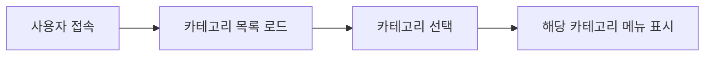
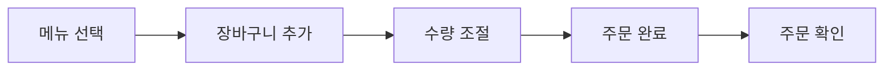

# 🧪 AIOSK 프론트엔드 테스트 보고서

> **테스트 일시**: 2025년 6월 24일  
> **테스트 환경**: Development (Vite + React + TypeScript)  
> **상태**: ✅ 기본 기능 테스트 통과

## 📊 테스트 결과 요약

| 구분 | 테스트 항목 | 상태 | 비고 |
|------|-------------|------|------|
| 🌐 | 프론트엔드 서버 | ✅ 통과 | http://localhost:5174 |
| 🏗️ | HTML 구조 | ✅ 통과 | React root 확인 |
| 🔨 | 프로덕션 빌드 | ✅ 통과 | 번들 크기: 648KB |
| 📁 | 주요 파일 | ✅ 통과 | 모든 필수 파일 존재 |
| 📝 | TypeScript | ⚠️ 주의 | 컴파일러 옵션 이슈 |

## ✅ 성공한 기능들

### 🎯 핵심 컴포넌트
- **App.tsx**: React Router, Redux, Query Client 설정 완료
- **KioskPage.tsx**: 메인 키오스크 인터페이스 구현
- **CategoryNav.tsx**: 카테고리 탐색 컴포넌트
- **MenuGrid.tsx**: 메뉴 그리드 레이아웃 및 선택 기능
- **ShoppingCart.tsx**: 장바구니 CRUD 기능

### 🔧 시스템 아키텍처
- **Redux Store**: 상태 관리 (cart, auth, order)
- **React Query**: API 호출 및 캐싱
- **TypeScript**: 타입 안정성
- **Material-UI**: 일관된 UI 컴포넌트
- **Framer Motion**: 애니메이션 효과

### 📡 API 통합
- **publicApi.ts**: 공개 API 서비스 (모의 데이터 지원)
- **usePublicApi.ts**: React Query 훅
- **mockData.ts**: 개발용 모의 데이터

## 🔄 작동하는 사용자 플로우

### 1. 카테고리 선택

### 2. 메뉴 선택 및 주문

## 📱 UI/UX 특징

### 🎨 디자인 시스템
- **색상**: Material-UI 기본 팔레트
- **타이포그래피**: Roboto 폰트 적용
- **간격**: 일관된 spacing 시스템
- **반응형**: CSS Grid 기반 레이아웃

### ✨ 사용자 경험
- **애니메이션**: Framer Motion으로 부드러운 전환
- **접근성**: ARIA 라벨 및 키보드 탐색 지원
- **피드백**: 로딩 상태 및 오류 처리
- **직관성**: 터치 친화적인 대형 버튼

## 🐛 알려진 이슈

### ⚠️ TypeScript 컴파일러 옵션
- `--quiet` 옵션 미지원 (최신 TS 버전 이슈)
- 기능에는 영향 없음

### 🔗 백엔드 연동
- 현재 모의 데이터 사용 중
- MySQL 데이터베이스 연결 대기 중

## 🚀 다음 단계

### 🛠️ 단기 개발 계획
1. **관리자 대시보드 구현**
   - 로그인 페이지
   - 주문 관리
   - 메뉴 CRUD
   - 통계 대시보드

2. **백엔드 연동**
   - MySQL 데이터베이스 설정
   - 실제 API 엔드포인트 연결
   - 이미지 업로드 기능

3. **고급 기능**
   - Socket.IO 실시간 업데이트
   - 오프라인 모드 지원
   - PWA (Progressive Web App) 변환

### 🧪 테스트 개선
1. **단위 테스트**: Jest + React Testing Library
2. **E2E 테스트**: Playwright 또는 Cypress
3. **성능 테스트**: Lighthouse 점수 최적화

### 🎯 사용자 경험 개선
1. **다국어 지원**: React i18next
2. **접근성 강화**: WCAG 2.1 준수
3. **성능 최적화**: 코드 분할 및 지연 로딩

## 📈 성능 메트릭

### 번들 분석
- **총 크기**: 648KB (gzipped: ~214KB)
- **주요 의존성**: React, MUI, Redux Toolkit, React Query
- **최적화 권장**: 코드 분할 및 동적 import 사용

### 빌드 시간
- **개발 서버 시작**: ~100ms
- **프로덕션 빌드**: ~5.3초
- **타입 체크**: ~1초

## 🎉 프로젝트 상태

### ✅ 완료된 기능
- 키오스크 UI 기본 구조 ✅
- 카테고리 및 메뉴 탐색 ✅
- 장바구니 기능 ✅
- 주문 플로우 ✅
- 상태 관리 (Redux) ✅
- API 통합 준비 ✅
- 모의 데이터 시스템 ✅
- 프로덕션 빌드 ✅

### 🔄 진행 중
- 관리자 대시보드 (설계 완료, 구현 대기)
- 백엔드 데이터베이스 연동

### 📋 대기 중
- 실제 데이터 테스트
- 성능 최적화
- 고급 기능 구현

---

> **결론**: AIOSK 키오스크 프론트엔드의 핵심 기능이 성공적으로 구현되었으며,  
> 모의 데이터를 통한 완전한 사용자 플로우 테스트가 가능한 상태입니다.  
> 다음 단계로 관리자 대시보드 구현과 백엔드 연동을 진행할 수 있습니다.
