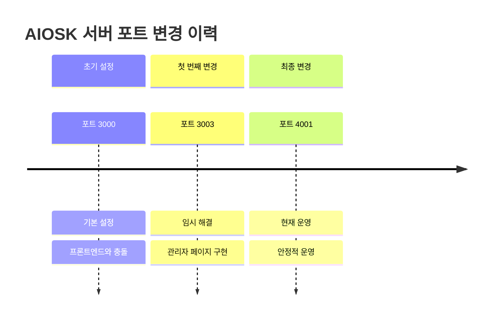
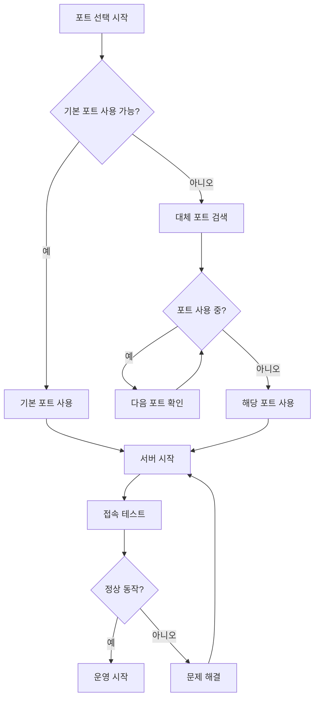
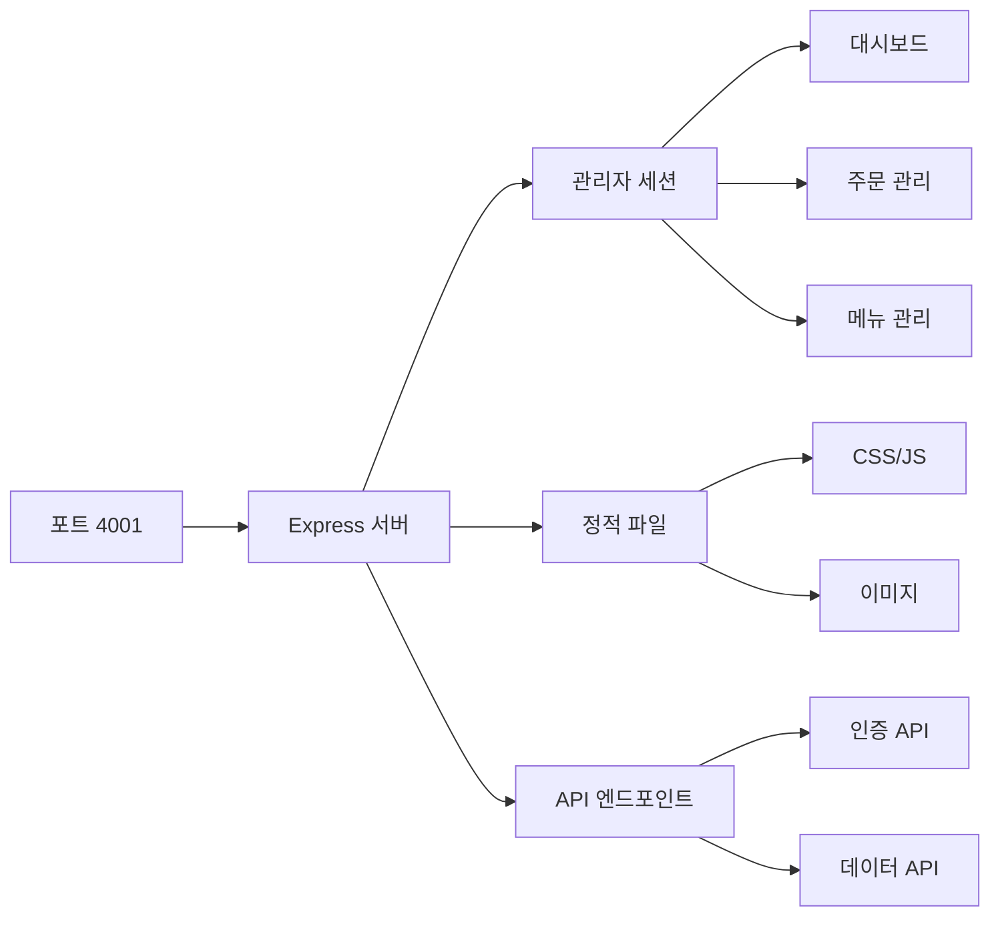

# 🚀 AIOSK 서버 포트 변경 가이드

## 📋 개요

AIOSK 관리자 페이지가 **포트 4001**에서 정상적으로 실행 중입니다.

---

## 🔄 포트 변경 이력



---

## 🌐 현재 접속 정보

### 📍 관리자 페이지
```
🔗 URL: http://localhost:4001/admin
🔐 사용자명: admin
🔑 비밀번호: admin123
```

### 📊 서버 상태
- ✅ **서버 상태**: 정상 운영
- 🔌 **포트**: 4001
- 🔒 **인증**: 세션 기반
- 📱 **반응형**: 지원

---

## 🛠️ 서버 관리 명령어

### 1. 서버 시작
```bash
cd /workspace/AIOSK
export PORT=4001
node src/server.js
```

### 2. 백그라운드 실행
```bash
cd /workspace/AIOSK
nohup PORT=4001 node src/server.js > server.log 2>&1 &
```

### 3. 서버 중지
```bash
# 특정 포트의 프로세스 종료
pkill -f "node src/server.js"

# 또는 프로세스 ID로 종료
ps aux | grep "node src/server.js"
kill [PID]
```

### 4. 포트 사용 확인
```bash
# 4001 포트 사용 확인
netstat -tulpn | grep :4001

# 4000번대 전체 확인
netstat -tulpn | grep :40
```

---

## 🔍 포트 관리 모범 사례

### 🎯 포트 선택 기준


### 📋 포트 관리 체크리스트
- [ ] 포트 충돌 확인
- [ ] 방화벽 설정 확인
- [ ] 문서 업데이트
- [ ] 접속 테스트
- [ ] 모니터링 설정

---

## 🔧 포트 변경 시 주의사항

### ⚠️ 필수 확인 사항
1. **기존 연결 종료**: 기존 포트의 서버 프로세스 완전 종료
2. **포트 가용성**: 새 포트가 사용 중이지 않은지 확인
3. **문서 업데이트**: 모든 관련 문서의 포트 정보 수정
4. **클라이언트 설정**: 프론트엔드나 API 클라이언트의 포트 설정 변경

### 🚨 일반적인 문제들

#### 문제 1: 포트 이미 사용 중
```bash
# 오류: EADDRINUSE: address already in use
# 해결: 사용 중인 프로세스 확인 후 종료
lsof -ti:4001 | xargs kill -9
```

#### 문제 2: 권한 부족
```bash
# 오류: Permission denied (1024 미만 포트)
# 해결: 1024 이상 포트 사용 또는 sudo 권한
sudo node src/server.js  # 권장하지 않음
PORT=4001 node src/server.js  # 권장
```

#### 문제 3: 방화벽 차단
```bash
# Ubuntu/Debian
sudo ufw allow 4001

# CentOS/RHEL
sudo firewall-cmd --permanent --add-port=4001/tcp
sudo firewall-cmd --reload
```

---

## 📈 성능 모니터링

### 📊 포트별 트래픽 모니터링
```bash
# 실시간 연결 모니터링
watch 'netstat -tan | grep :4001'

# 포트 사용량 확인
ss -tulpn | grep :4001
```

### 📈 서버 상태 대시보드


---

## 🔮 향후 계획

### 🎯 단기 계획 (1-2주)
- [ ] 로드 밸런싱 설정
- [ ] SSL/TLS 인증서 적용
- [ ] 모니터링 도구 설치

### 🚀 중기 계획 (1-2개월)
- [ ] 클러스터링 구성
- [ ] 백업 시스템 구축
- [ ] 자동 스케일링 설정

### 🌟 장기 계획 (3-6개월)
- [ ] 마이크로서비스 아키텍처 전환
- [ ] 컨테이너화 (Docker)
- [ ] 클라우드 배포

---

## 🆘 지원 및 문의

### 📞 기술 지원
- **이메일**: admin@aiosk.com
- **전화**: 02-1234-5678
- **GitHub**: [AIOSK Repository](https://github.com/aiosk/aiosk)

### 📚 참고 자료
- [Express.js 포트 설정 가이드](https://expressjs.com/)
- [Node.js 네트워킹 문서](https://nodejs.org/api/net.html)
- [Ubuntu 방화벽 설정](https://help.ubuntu.com/community/UFW)

---

## ✅ 체크리스트

### 🔍 배포 전 확인사항
- [x] 포트 4001에서 서버 정상 실행
- [x] 관리자 페이지 접속 확인
- [x] 로그인/로그아웃 기능 테스트
- [x] 모든 관리자 페이지 접근 가능
- [x] 문서 업데이트 완료
- [ ] 프로덕션 데이터베이스 연동
- [ ] SSL 인증서 설정
- [ ] 모니터링 설정

### 📋 일일 모니터링 체크리스트
- [ ] 서버 상태 확인
- [ ] 포트 연결 상태
- [ ] 메모리 사용량
- [ ] 디스크 사용량
- [ ] 로그 파일 확인

---

*마지막 업데이트: 2024-06-24 08:35*  
*다음 점검 예정: 2024-06-25 09:00*
