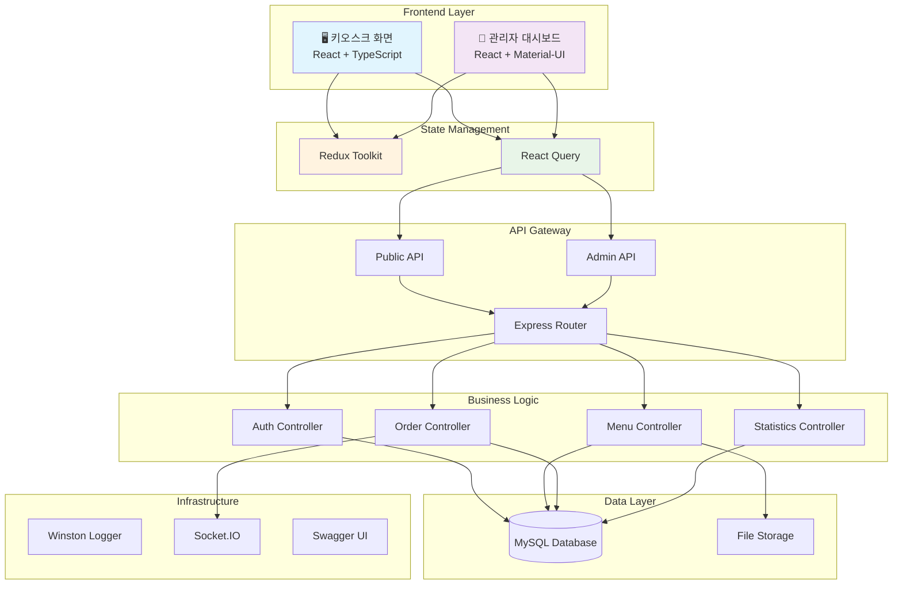
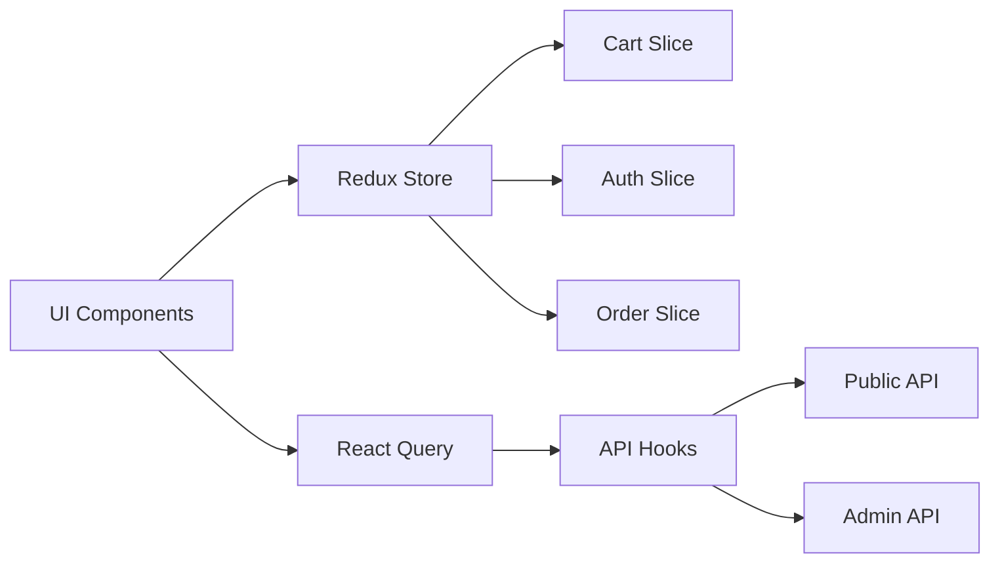

# 🍽️ AIOSK - 키오스크 풀스택 시스템

> **All-In-One Smart Kiosk** - 현대적인 키오스크 서비스를 위한 완전한 풀스택 솔루션


---

## 📋 목차

- [🌟 프로젝트 소개](#-프로젝트-소개)
- [✨ 주요 기능](#-주요-기능)
- [🏗️ 시스템 아키텍처](#️-시스템-아키텍처)
- [🎨 프론트엔드](#-프론트엔드)
- [🚀 빠른 시작](#-빠른-시작)
- [📖 API 문서](#-api-문서)
- [🔧 환경 설정](#-환경-설정)
- [📁 프로젝트 구조](#-프로젝트-구조)
- [🧪 테스트](#-테스트)
- [📊 모니터링 및 로깅](#-모니터링-및-로깅)
- [🛡️ 보안](#️-보안)
- [🤝 기여 가이드](#-기여-가이드)
- [📝 라이선스](#-라이선스)

---

## 🌟 프로젝트 소개

**AIOSK**는 현대적인 레스토랑 키오스크 서비스를 위한 **엔터프라이즈급 풀스택 시스템**입니다.  
React/TypeScript 기반의 터치 친화적 키오스크 인터페이스와 Node.js 백엔드 API가 완벽하게 통합되어  
실시간 주문 처리, 메뉴 관리, 통계 분석 등 키오스크 운영에 필요한 모든 기능을 제공합니다.

### 🎯 **핵심 가치**

- **🚀 Production Ready**: 실제 상용 서비스 배포 가능한 완성도
- **📱 모던 UI/UX**: React + Material-UI 기반 직관적 인터페이스
- **📈 확장성**: 마이크로서비스 아키텍처 기반 모듈 설계
- **🔒 보안**: JWT 인증, bcrypt 해싱, SQL 인젝션 방지
- **📊 모니터링**: Winston 기반 구조화된 로깅 시스템
- **📖 개발자 친화적**: Swagger UI를 통한 인터랙티브 API 문서

---

## ✨ 주요 기능

### 🔓 **공개 API** (키오스크용)

- 📋 카테고리 및 메뉴 조회
- 🛒 주문 생성 및 실시간 알림
- 📱 키오스크 화면용 최적화된 응답

### 🔐 **관리자 API**

- 👤 JWT 기반 인증 시스템
- 🍽️ 메뉴/카테고리 CRUD 관리
- 📦 주문 상태 관리 및 취소
- 📈 매출 통계 및 리포트 (CSV 내보내기)
- 📸 메뉴 이미지 업로드 시스템

### 📊 **고급 기능**

- ⚡ Socket.IO 실시간 알림
- 📋 다차원 통계 분석 (일별/시간별/카테고리별)
- 🖼️ Multer 기반 파일 업로드
- 🚨 중앙화된 에러 처리 및 로깅
- 📖 Swagger/OpenAPI 3.0 자동 문서화

---

## 🏗️ 시스템 아키텍처



---

## 🎨 프론트엔드

### 🛠️ **기술 스택**

- **프레임워크**: React 19.1.0 + TypeScript 5.8.3
- **빌드 도구**: Vite 6.3.5 (HMR, 고속 빌드)
- **UI 라이브러리**: Material-UI (MUI) 7.1.2
- **상태 관리**: Redux Toolkit + React Query
- **라우팅**: React Router 7.6.2
- **애니메이션**: Framer Motion 12.19.1
- **HTTP 클라이언트**: Axios 1.10.0
- **실시간 통신**: Socket.IO Client 4.8.1

### 🖼️ **UI/UX 특징**

- **터치 친화적**: 대형 버튼 및 직관적 네비게이션
- **반응형 디자인**: 다양한 키오스크 화면 크기 지원
- **접근성**: ARIA 라벨 및 키보드 탐색 지원
- **애니메이션**: 부드러운 페이지 전환 및 인터랙션
- **모의 데이터**: 백엔드 없이도 완전한 기능 테스트 가능

### 📱 **키오스크 화면 구성**

1. **카테고리 탐색**: 탭 기반 카테고리 선택
2. **메뉴 그리드**: CSS Grid 기반 메뉴 카드 레이아웃
3. **장바구니**: 실시간 수량 조절 및 가격 계산
4. **주문 완료**: 주문 확인 및 성공 피드백

### 🔄 **상태 관리 구조**



### 📊 **프론트엔드 현황**

- ✅ **키오스크 UI**: 완전 구현
- ✅ **상태 관리**: Redux + React Query 설정 완료
- ✅ **모의 데이터**: 풀 플로우 테스트 가능
- ✅ **프로덕션 빌드**: 648KB (gzipped: 214KB)
- 🔄 **관리자 대시보드**: 구현 예정
- 🔄 **백엔드 연동**: 데이터베이스 설정 후 진행

### 🚀 **프론트엔드 실행**

```bash
# 프론트엔드 디렉토리로 이동
cd frontend

# 의존성 설치
npm install

# 개발 서버 실행
npm run dev

# 프로덕션 빌드
npm run build
```

### 🌐 **접속 URL**

- **키오스크 화면**: http://localhost:5174
- **개발 서버**: 자동 새로고침 지원
- **모의 데이터**: 백엔드 없이 완전한 기능 체험 가능

---

## 🚀 빠른 시작

### 📋 **시스템 요구사항**

- **Node.js**: 18.0.0 이상
- **MySQL**: 8.0 이상
- **npm**: 8.0.0 이상

### 📦 **설치**

```bash
# 저장소 클론
git clone https://github.com/your-username/aiosk.git
cd aiosk

# 의존성 설치
npm install

# 환경 변수 설정
cp .env.example .env
# .env 파일을 편집하여 데이터베이스 및 설정 정보 입력

# 데이터베이스 스키마 생성
mysql -u your_username -p your_database < database_schema.sql
```

### ⚙️ **환경 변수 설정**

`.env` 파일을 생성하고 다음 정보를 입력하세요:

```env
# 데이터베이스 설정
DB_HOST=localhost
DB_USER=your_username
DB_PASS=your_password
DB_NAME=kiosk_db

# JWT 설정
JWT_SECRET=your-super-secret-jwt-key

# 서버 설정
PORT=3000

# 로깅 설정
LOG_LEVEL=info
LOG_FILE=./logs/app.log

# 파일 업로드 설정
UPLOAD_DIR=./uploads
MAX_FILE_SIZE=5242880
```

### 🏃‍♂️ **실행**

```bash
# 개발 모드 (nodemon 사용)
npm run dev

# 프로덕션 모드
npm start
```

서버가 성공적으로 시작되면:

- 🌐 **API 서버**: http://localhost:3000
- 📖 **API 문서**: http://localhost:3000/api-docs
- 📊 **문서화 대시보드**: http://localhost:3000/docs

---

## 📖 API 문서

### 🔗 **Swagger UI**

완전한 인터랙티브 API 문서는 서버 실행 후 다음 URL에서 확인할 수 있습니다:

**👉 [http://localhost:3000/api-docs](http://localhost:3000/api-docs)**

### 📋 **주요 엔드포인트**

#### 🔓 **공개 API** (키오스크용)

```http
GET    /api/public/categories     # 카테고리 목록 조회
GET    /api/public/menus         # 메뉴 목록 조회 (카테고리별 필터링)
POST   /api/public/orders        # 주문 생성
```

#### 🔐 **관리자 API**

```http
POST   /api/admin/login          # 관리자 로그인
GET    /api/admin/orders         # 주문 목록 조회
PUT    /api/admin/orders/:id     # 주문 상태 업데이트
DELETE /api/admin/orders/:id     # 주문 취소
GET    /api/admin/statistics/*   # 통계 데이터 조회
POST   /api/menus                # 메뉴 생성 (이미지 업로드 포함)
```

### 📝 **API 테스트 가이드**

상세한 API 테스트 방법은 [`API_TEST_GUIDE.md`](./API_TEST_GUIDE.md)를 참조하세요.

---

## 🔧 환경 설정

### 🗄️ **데이터베이스 설정**

MySQL 데이터베이스를 생성하고 스키마를 적용하세요:

```sql
CREATE DATABASE kiosk_db CHARACTER SET utf8mb4 COLLATE utf8mb4_unicode_ci;
SOURCE database_schema.sql;
```

### 📁 **디렉토리 구조**

업로드된 파일과 로그를 위한 디렉토리가 자동 생성됩니다:

- `./uploads/` - 메뉴 이미지 저장
- `./logs/` - 애플리케이션 로그

---

## 📁 프로젝트 구조

```
AIOSK/
├── 📄 README.md
├── 📋 REQUIREMENTS.md          # 기능 요구사항 명세서
├── 📖 API_TEST_GUIDE.md        # API 테스트 가이드
├── 🗄️ database_schema.sql      # 데이터베이스 스키마
├── 📦 package.json
├── 🔧 .env.example
├── 🎨 FRONTEND_DEVELOPMENT_PLAN.md  # 프론트엔드 개발 계획
├── 🧪 FRONTEND_TEST_REPORT.md      # 프론트엔드 테스트 보고서
├── frontend/                   # 🎨 프론트엔드 (React + TypeScript)
│   ├── 📦 package.json
│   ├── ⚙️ vite.config.ts
│   ├── 📝 tsconfig.json
│   ├── 🌐 index.html
│   ├── 📁 public/
│   └── 📁 src/
│       ├── 🚀 main.tsx          # 앱 진입점
│       ├── 📱 App.tsx           # 메인 앱 컴포넌트
│       ├── 📁 components/       # 재사용 가능한 컴포넌트
│       │   ├── ui/              # 기본 UI 컴포넌트
│       │   │   ├── Button.tsx
│       │   │   ├── Card.tsx
│       │   │   └── Modal.tsx
│       │   ├── kiosk/           # 키오스크 전용 컴포넌트
│       │   │   ├── CategoryNav.tsx
│       │   │   ├── MenuGrid.tsx
│       │   │   └── ShoppingCart.tsx
│       │   └── admin/           # 관리자 컴포넌트 (예정)
│       ├── 📁 pages/            # 페이지 컴포넌트
│       │   └── KioskPage.tsx
│       ├── 📁 hooks/            # 커스텀 React 훅
│       │   ├── usePublicApi.ts
│       │   └── useAdminApi.ts
│       ├── 📁 services/         # API 서비스
│       │   ├── api.ts           # 기본 API 설정
│       │   ├── publicApi.ts     # 공개 API
│       │   └── adminApi.ts      # 관리자 API
│       ├── 📁 store/            # Redux 상태 관리
│       │   ├── index.ts
│       │   └── slices/
│       │       ├── cartSlice.ts
│       │       ├── authSlice.ts
│       │       └── orderSlice.ts
│       ├── 📁 types/            # TypeScript 타입 정의
│       │   └── index.ts
│       ├── 📁 data/             # 모의 데이터
│       │   └── mockData.ts
│       └── 📁 utils/            # 유틸리티 함수
└── src/                        # 🔧 백엔드 (Node.js + Express)
    ├── 🚀 server.js             # 메인 서버 파일
    ├── config/
    │   ├── 🗄️ db.config.js      # 데이터베이스 설정
    │   └── 📖 swagger.config.js  # Swagger 설정
    ├── controllers/             # 비즈니스 로직
    │   ├── public/              # 공개 API 컨트롤러
    │   │   ├── category.controller.js
    │   │   ├── menu.controller.js
    │   │   └── order.controller.js
    │   ├── admin/               # 관리자 API 컨트롤러
    │   │   ├── order.controller.js
    │   │   └── statistics.controller.js
    │   └── *.controller.js      # 기타 컨트롤러
    ├── middleware/              # 미들웨어
    │   ├── 🔐 auth.middleware.js  # JWT 인증
    │   ├── 🚨 error.middleware.js # 에러 처리
    │   ├── 📊 logging.middleware.js # 로깅
    │   └── 📸 upload.middleware.js # 파일 업로드
    ├── models/                  # 데이터 모델
    │   ├── 🗄️ db.js             # 데이터베이스 연결
    │   └── *.model.js           # 각종 모델
    ├── routes/                  # 라우터
    │   ├── public/              # 공개 API 라우트
    │   ├── admin/               # 관리자 API 라우트
    │   └── *.routes.js          # 기타 라우트
    └── utils/
        └── 📊 logger.js          # Winston 로거 설정
```

    │   └── 📸 upload.middleware.js # 파일 업로드
    ├── models/                  # 데이터 모델
    │   ├── 🗄️ db.js             # 데이터베이스 연결
    │   └── *.model.js           # 각종 모델
    ├── routes/                  # 라우터
    │   ├── public/              # 공개 API 라우트
    │   ├── admin/               # 관리자 API 라우트
    │   └── *.routes.js          # 기타 라우트
    └── utils/
        └── 📊 logger.js          # Winston 로거 설정

````

---

## 🧪 테스트

### 🖱️ **수동 테스트**
프로젝트에는 HTML 기반 테스트 페이지가 포함되어 있습니다:

- **파일 업로드 테스트**: `test_upload.html`
- **주문 관리 테스트**: `test_order_management.html`
- **통계 대시보드**: `test_statistics_dashboard.html`

### 🔧 **cURL 테스트 예시**

```bash
# 카테고리 조회
curl -X GET http://localhost:3000/api/public/categories

# 주문 생성
curl -X POST http://localhost:3000/api/public/orders \
  -H "Content-Type: application/json" \
  -d '{"items":[{"menu_id":1,"quantity":2}],"customer_name":"홍길동"}'

# 관리자 로그인
curl -X POST http://localhost:3000/api/admin/login \
  -H "Content-Type: application/json" \
  -d '{"username":"admin","password":"admin123"}'
````

### 🤖 **자동화 테스트** (향후 개발)

현재는 수동 테스트를 지원하며, Jest/Mocha 기반 자동화 테스트는 향후 버전에서 추가될 예정입니다.

---

## 📊 모니터링 및 로깅

### 📋 **로깅 시스템**

Winston 기반의 구조화된 로깅을 제공합니다:

```javascript
// 로그 레벨
- error: 에러 발생 시
- warn: 경고 상황
- info: 일반 정보 (기본값)
- debug: 디버그 정보
```

### 📁 **로그 파일**

- `./logs/app.log` - 모든 로그
- `./logs/error.log` - 에러 로그만
- `./logs/combined.log` - 결합된 로그

### 📊 **모니터링 대상**

- HTTP 요청/응답 로깅
- 성능 메트릭 (응답 시간)
- 보안 이벤트 (로그인 실패 등)
- 에러 발생 및 스택 트레이스

---

## 🛡️ 보안

### 🔐 **인증 및 권한**

- **JWT 토큰**: 관리자 API 보호
- **bcrypt 해싱**: 패스워드 암호화
- **Role-based Access**: 관리자/사용자 권한 분리

### 🚨 **보안 기능**

- **SQL Injection 방지**: Prepared Statements 사용
- **XSS 방지**: 입력 데이터 검증
- **파일 업로드 보안**: 파일 타입 및 크기 제한
- **Rate Limiting**: 과도한 요청 방지 (향후 추가 예정)

### 🔍 **보안 모니터링**

- 로그인 실패 추적
- 비정상적인 API 호출 감지
- 파일 업로드 오남용 방지

---

## 🤝 기여 가이드

### 📋 **기여 방법**

1. 이 저장소를 Fork합니다
2. 새로운 기능 브랜치를 생성합니다 (`git checkout -b feature/AmazingFeature`)
3. 변경사항을 커밋합니다 (`git commit -m 'Add some AmazingFeature'`)
4. 브랜치에 Push합니다 (`git push origin feature/AmazingFeature`)
5. Pull Request를 생성합니다

### 📝 **코딩 스타일**

- ESLint 규칙 준수
- JSDoc 주석으로 함수 문서화
- RESTful API 설계 원칙 따르기
- 에러 처리 및 로깅 필수

### 🧪 **테스트 가이드**

- 새로운 기능 추가 시 테스트 케이스 작성
- API 엔드포인트는 Swagger 문서 업데이트
- 에러 처리 시나리오 포함

---

## 📈 로드맵

### 🚧 **현재 버전 (v1.0)**

- ✅ 모든 핵심 기능 구현 완료
- ✅ 프로덕션 레디 상태
- ✅ 완전한 API 문서화

### 🔮 **향후 계획 (v1.1+)**

- 🤖 Jest/Mocha 자동화 테스트 추가
- 🚀 Docker 컨테이너화
- 📊 Prometheus/Grafana 모니터링
- 🔄 Redis 캐싱 시스템
- 🌐 다국어 지원 (i18n)
- 📱 푸시 알림 시스템

---

## 🆘 문제 해결

### ❓ **자주 묻는 질문**

**Q: 서버가 시작되지 않아요**
A: `.env` 파일의 데이터베이스 설정을 확인하고, MySQL 서버가 실행 중인지 확인하세요.

**Q: 파일 업로드가 실패해요**
A: `uploads/` 디렉토리의 권한을 확인하고, 파일 크기가 5MB를 초과하지 않는지 확인하세요.

**Q: API 문서가 보이지 않아요**
A: 서버 실행 후 `http://localhost:3000/api-docs`에 접속하세요.

### 🔧 **디버깅**

로그 파일을 확인하여 상세한 에러 정보를 얻을 수 있습니다:

```bash
tail -f ./logs/error.log
```

---

## 📞 지원

문제가 발생하거나 질문이 있으시면:

- 📧 **이메일**: support@aiosk.com
- 🐛 **Issues**: [GitHub Issues](https://github.com/your-username/aiosk/issues)
- 📖 **문서**: [API 문서](http://localhost:3000/api-docs)

---

## 📝 라이선스

이 프로젝트는 **ISC 라이선스** 하에 배포됩니다. 자세한 내용은 [LICENSE](LICENSE) 파일을 참조하세요.

---

## 🙏 감사의 말

AIOSK 프로젝트를 만들어주신 모든 기여자분들께 감사드립니다.

**핵심 기술 스택:**

- [Express.js](https://expressjs.com/) - 웹 프레임워크
- [MySQL2](https://github.com/sidorares/node-mysql2) - 데이터베이스
- [Socket.IO](https://socket.io/) - 실시간 통신
- [Winston](https://github.com/winstonjs/winston) - 로깅
- [Swagger](https://swagger.io/) - API 문서화
- [JWT](https://jwt.io/) - 인증
- [Multer](https://github.com/expressjs/multer) - 파일 업로드

---

<div align="center">

**🚀 AIOSK - 키오스크의 미래를 만들어갑니다 🚀**

[](https://github.com/your-username/aiosk)
[](https://nodejs.org/)
[](https://www.mysql.com/)
[](https://expressjs.com/)

</div>
