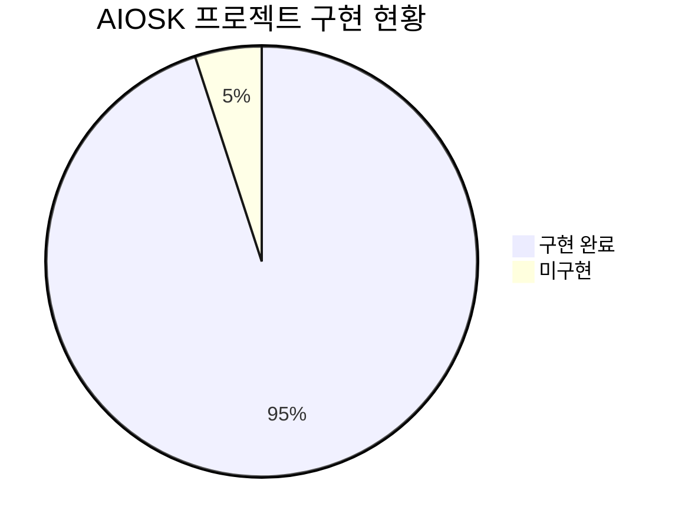
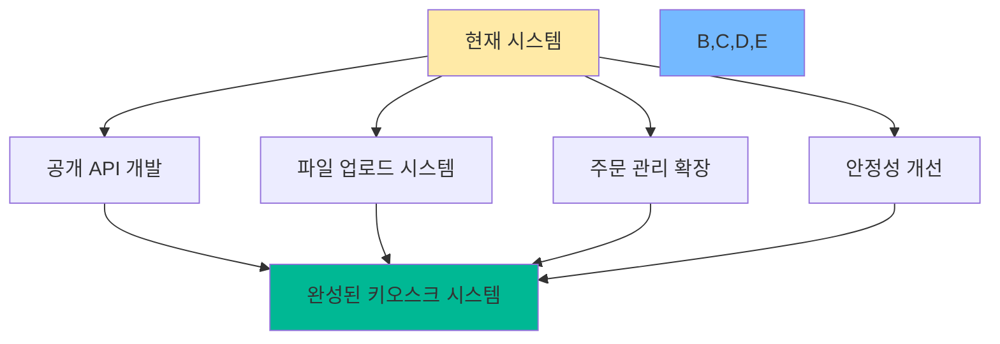
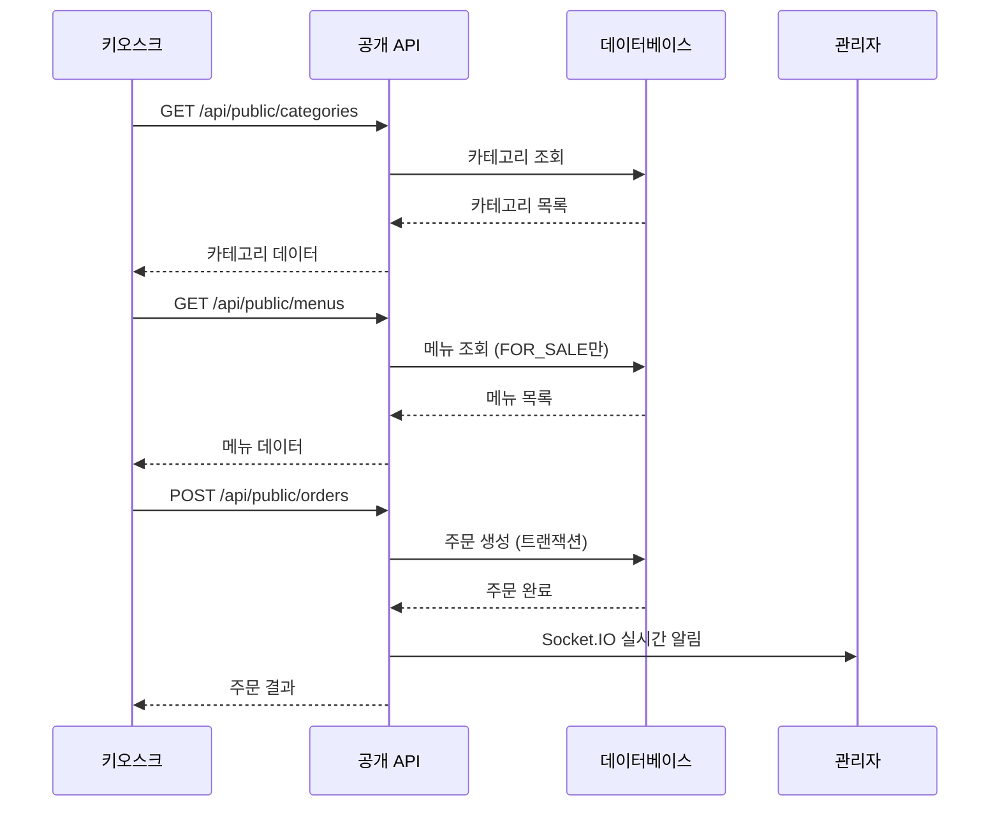
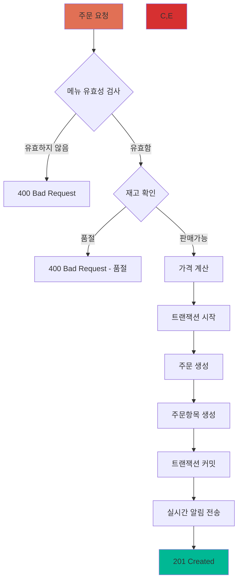
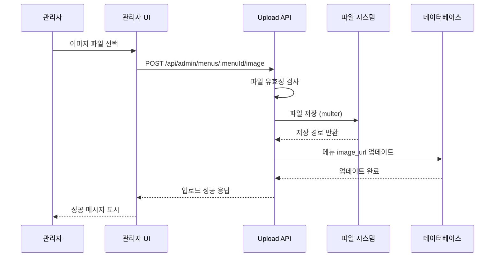
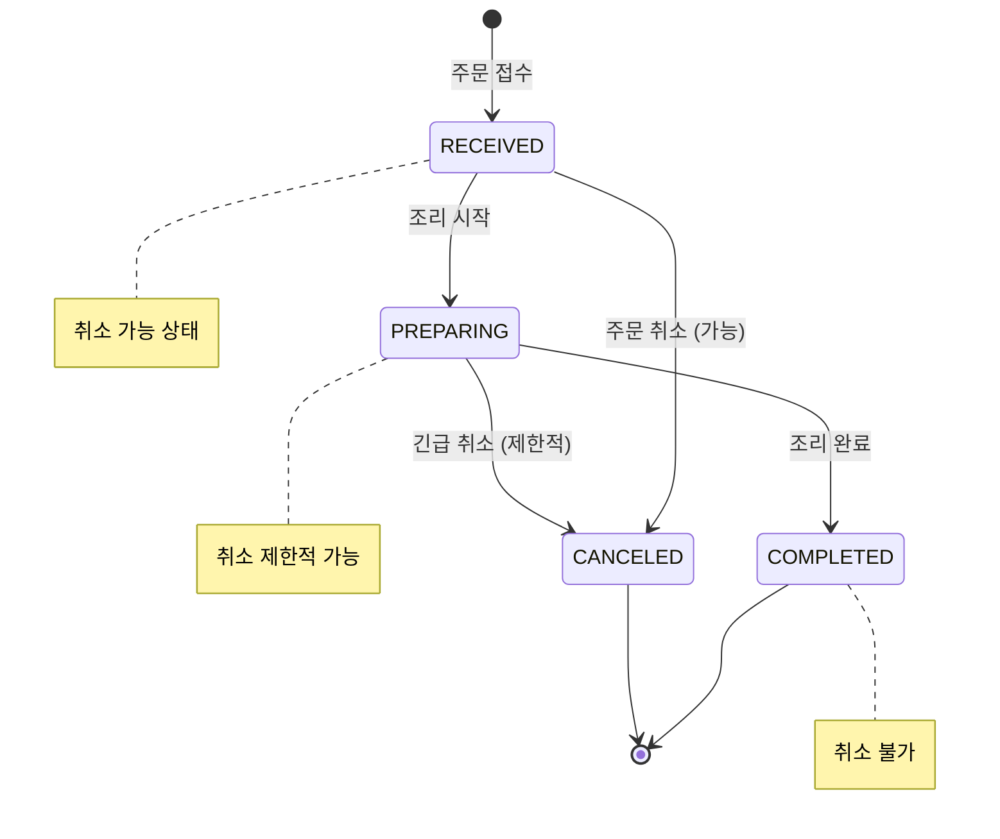
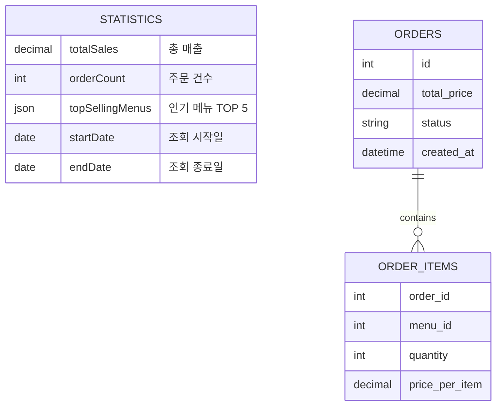
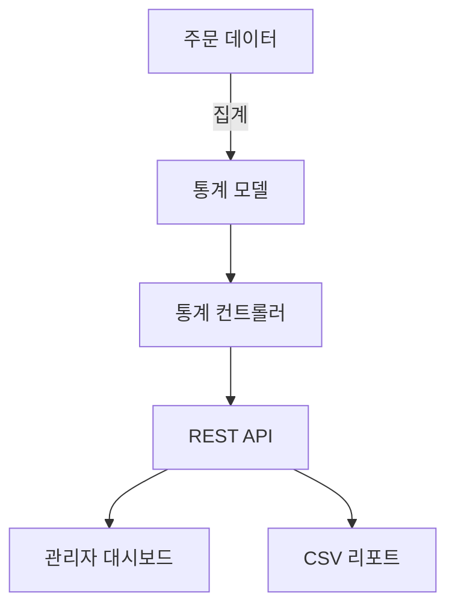
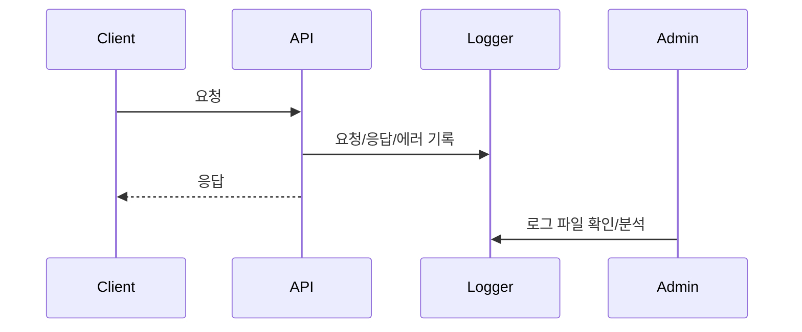

# 🚀 AIOSK 프로젝트 미구현 기능 요구사항 명세서

> **프로젝트 버전**: v1.0  
> **작성일**: 2025년 6월 15일  
> **상태**: 📋 요구사항 정의 완료

---

## 📋 목차

- [📊 프로젝트 현황 개요](#-프로젝트-현황-개요)
- [🎯 구현 목표](#-구현-목표)
- [🔓 1. 공개 API 엔드포인트](#-1-공개-api-엔드포인트)
- [📁 2. 파일 업로드 시스템](#-2-파일-업로드-시스템)
- [📈 3. 주문 관리 확장 기능](#-3-주문-관리-확장-기능)
- [🛠️ 4. 개발 환경 및 안정성 개선](#️-4-개발-환경-및-안정성-개선)
- [🚨 발견된 이슈 해결 방안](#-발견된-이슈-해결-방안)
- [🔄 구현 우선순위](#-구현-우선순위)

---

## 📊 프로젝트 현황 개요



### ✅ 구현 완료된 기능

- Admin 인증 시스템 (JWT)
- 카테고리/메뉴 관리 (CRUD)
- 주문 시스템 (기본)
- 실시간 알림 (Socket.IO)
- **🆕 키오스크용 공개 API** ✨
- **🆕 라우트 구조 개선** ✨
- **🆕 파일 업로드 시스템** ✨
- **🆕 주문 취소 및 상태 관리** ✨
- **🆕 통계 및 리포트 기능** ✨
- **🆕 중앙화된 에러 처리 및 고급 로깅 시스템** ✨

### ❌ 미구현 기능

- 없음

---

## 🎯 구현 목표

이 명세서는 **AIOSK 프로젝트의 미구현 기능을 완성**하여 실제 운영 가능한 키오스크 시스템으로 발전시키기 위한 구체적인 목표와 요구사항을 정의합니다.



---

## 🔓 1. 공개 API 엔드포인트

### 🎯 목표

키오스크 클라이언트가 **별도의 인증 절차 없이** 메뉴를 보고 주문을 생성할 수 있도록 공개 API를 제공합니다.

### 🏗️ 시스템 아키텍처



### 📋 상세 기능 요구사항

#### 1.1 카테고리 목록 조회 API

| 항목           | 내용                         |
| -------------- | ---------------------------- |
| **엔드포인트** | `GET /api/public/categories` |
| **인증**       | 🚫 불필요                    |
| **요청**       | 없음                         |
| **응답 상태**  | `200 OK`                     |

**응답 예시:**

```json
[
  {
    "categoryId": 1,
    "name": "커피",
    "sortOrder": 1
  },
  {
    "categoryId": 2,
    "name": "음료",
    "sortOrder": 2
  }
]
```

> 📌 **중요**: `sort_order`를 기준으로 오름차순 정렬하여 모든 카테고리 목록을 반환합니다.

---

#### 1.2 메뉴 목록 조회 API

| 항목              | 내용                    |
| ----------------- | ----------------------- |
| **엔드포인트**    | `GET /api/public/menus` |
| **인증**          | 🚫 불필요               |
| **쿼리 파라미터** | `categoryId` (선택사항) |
| **응답 상태**     | `200 OK`                |

**응답 예시:**

```json
[
  {
    "menuId": 101,
    "name": "아메리카노",
    "description": "진한 에스프레소와 물의 조화",
    "price": 4500,
    "imageUrl": "/images/americano.jpg",
    "status": "FOR_SALE",
    "categoryId": 1
  }
]
```

> ⚠️ **필터링 조건**: `FOR_SALE` 상태인 메뉴만 조회되어야 합니다. `SOLD_OUT` 상태의 메뉴는 목록에 포함되지 않습니다.

---

#### 1.3 주문 생성 API

| 항목             | 내용                      |
| ---------------- | ------------------------- |
| **엔드포인트**   | `POST /api/public/orders` |
| **인증**         | 🚫 불필요                 |
| **Content-Type** | `application/json`        |
| **응답 상태**    | `201 Created`             |

**요청 본문:**

```json
{
  "items": [
    { "menuId": 101, "quantity": 2 },
    { "menuId": 102, "quantity": 1 }
  ]
}
```

**응답 예시:**

```json
{
  "orderId": 1,
  "totalPrice": 13500,
  "status": "RECEIVED",
  "createdAt": "2025-06-15T14:30:00Z",
  "items": [
    { "menuName": "아메리카노", "quantity": 2, "price": 9000 },
    { "menuName": "카페라떼", "quantity": 1, "price": 4500 }
  ]
}
```

### 🔒 보안 및 검증 요구사항



**핵심 검증 사항:**

- 📊 **가격 계산**: 서버에서 메뉴 가격을 기준으로 직접 계산하여 신뢰성 보장
- 🔄 **트랜잭션 처리**: 주문 생성과 OrderItems 저장을 트랜잭션으로 처리하여 데이터 일관성 유지
- 📡 **실시간 알림**: 주문 성공 시 Socket.IO를 통한 관리자 페이지 실시간 알림

---

## 📁 2. 파일 업로드 시스템

### 🎯 목표

관리자가 **메뉴 이미지를 직접 서버에 업로드**하고 관리할 수 있는 시스템을 구축합니다.

### 🏗️ 파일 업로드 플로우



### 📋 상세 기능 요구사항

#### 2.1 메뉴 이미지 업로드 API

| 항목             | 내용                                  |
| ---------------- | ------------------------------------- |
| **엔드포인트**   | `POST /api/admin/menus/:menuId/image` |
| **인증**         | ✅ JWT 토큰 필요                      |
| **Content-Type** | `multipart/form-data`                 |
| **응답 상태**    | `200 OK`                              |

**응답 예시:**

```json
{
  "message": "이미지가 성공적으로 업로드되었습니다.",
  "imageUrl": "/uploads/menus/americano-1686823200000.jpg"
}
```

### 🛠️ 기술적 구현 요구사항

#### 2.2 파일 저장 규칙


**파일명 규칙:**

- 형식: `[메뉴명]-[타임스탬프].[확장자]`
- 예시: `americano-1686823200000.jpg`
- 목적: 파일명 중복 방지

#### 2.3 기술 스택 및 라이브러리

| 구분            | 기술/라이브러리       | 용도                           |
| --------------- | --------------------- | ------------------------------ |
| **파일 업로드** | `multer`              | 멀티파트 폼 데이터 처리        |
| **초기 저장소** | 로컬 파일 시스템      | `/uploads/menus/` 디렉토리     |
| **향후 확장**   | AWS S3 / Google Cloud | 클라우드 스토리지 마이그레이션 |

> 🔮 **확장성 고려**: 초기에는 로컬 서버에 저장하지만, 향후 AWS S3 같은 클라우드 스토리지 서비스로 확장할 수 있도록 유연하게 설계합니다.

---

## 📈 3. 주문 관리 확장 기능

### 🎯 목표

**주문 취소 및 통계 기능**을 추가하여 관리자가 매장 운영 현황을 더 효율적으로 파악하고 관리할 수 있도록 합니다.

### 🔄 주문 상태 관리 플로우



### 📋 상세 기능 요구사항

#### 3.1 주문 취소 기능

| 항목           | 내용                                      |
| -------------- | ----------------------------------------- |
| **엔드포인트** | `PATCH /api/admin/orders/:orderId/cancel` |
| **인증**       | ✅ JWT 토큰 필요                          |
| **응답 상태**  | `200 OK`                                  |

**응답 예시:**

```json
{
  "message": "주문이 성공적으로 취소되었습니다.",
  "orderId": 1,
  "status": "CANCELED"
}
```

**취소 규칙:**

- ✅ `RECEIVED` 상태: 취소 가능
- ⚠️ `PREPARING` 상태: 제한적 취소 가능 (관리자 확인 필요)
- ❌ `COMPLETED` 상태: 취소 불가

#### 3.2 주문 통계 및 리포트

| 항목              | 내용                        |
| ----------------- | --------------------------- |
| **엔드포인트**    | `GET /api/admin/statistics` |
| **인증**          | ✅ JWT 토큰 필요            |
| **쿼리 파라미터** | `startDate`, `endDate`      |
| **응답 상태**     | `200 OK`                    |

**응답 예시:**

```json
{
  "totalSales": 550000,
  "orderCount": 52,
  "topSellingMenus": [
    { "menuName": "아메리카노", "count": 30 },
    { "menuName": "카페라떼", "count": 15 }
  ]
}
```

### 📊 통계 데이터 구조



**통계 계산 요구사항:**

- 📈 **총 매출**: 지정 기간 동안의 `total_price` 합계
- 📋 **주문 건수**: 지정 기간 동안의 주문 총 개수
- 🏆 **인기 메뉴**: 주문 수량 기준 TOP 5 메뉴
- ⚡ **성능 최적화**: 집계 함수(SUM, COUNT, GROUP BY) 활용

---

## 🛠️ 4. 개발 환경 및 안정성 개선

### 🎯 목표

**중앙화된 에러 처리, 로깅, API 문서화**를 통해 코드의 안정성과 유지보수성을 높이고, 협업을 용이하게 합니다.

### 🏗️ 에러 처리 아키텍처

```mermaid
flowchart TD
    A[API 요청] --> B[라우터]
    B --> C[컨트롤러]
    C --> D[모델/서비스]
    D --> E{에러 발생?}
    E -->|예| F[next(error)]
    E -->|아니오| G[정상 응답]
    F --> H[중앙화된 에러 미들웨어]
    H --> I[로그 기록]
    H --> J[클라이언트 에러 응답]

    style H fill:#e84393
    style I fill:#fdcb6e
    style J fill:#d63031
```

### 📋 상세 기능 요구사항

#### 4.1 중앙화된 에러 핸들링 미들웨어

**구현 위치**: Express 애플리케이션의 최하단
**역할**: 모든 `next(error)` 호출을 가로채서 일관된 JSON 에러 메시지 반환

**표준 에러 응답 형식:**

```json
{
  "message": "에러 메시지 내용",
  "error": "INTERNAL_SERVER_ERROR",
  "timestamp": "2025-06-15T14:30:00Z"
}
```

#### 4.2 로깅 시스템 구축

**로깅 라이브러리**: `winston`

**로그 레벨 구성:**

| 레벨      | 용도           | 예시                   |
| --------- | -------------- | ---------------------- |
| **info**  | 일반 요청 정보 | API 호출 로그          |
| **warn**  | 경고 사항      | 재시도 가능한 오류     |
| **error** | 서버 오류      | 데이터베이스 연결 실패 |

**로그 내용:**

- 🌐 **요청 정보**: IP, Method, URL, 응답시간
- 🐛 **에러 추적**: 스택 트레이스, 에러 컨텍스트
- 📋 **비즈니스 이벤트**: 주문 생성/취소, 관리자 로그인

#### 4.3 API 문서화 (Swagger)

**사용 라이브러리:**

- `swagger-jsdoc`: JSDoc 주석 파싱
- `swagger-ui-express`: Swagger UI 제공

**문서화 엔드포인트**: `/api-docs`

**JSDoc 주석 예시:**

```javascript
/**
 * @swagger
 * /api/public/orders:
 *   post:
 *     summary: 새 주문 생성
 *     tags: [Public Orders]
 *     requestBody:
 *       required: true
 *       content:
 *         application/json:
 *           schema:
 *             type: object
 *             properties:
 *               items:
 *                 type: array
 *                 items:
 *                   type: object
 *                   properties:
 *                     menuId:
 *                       type: integer
 *                     quantity:
 *                       type: integer
 *     responses:
 *       201:
 *         description: 주문 생성 성공
 *         content:
 *           application/json:
 *             schema:
 *               $ref: '#/components/schemas/Order'
 */
```

---

## 📈 통계 및 리포트 기능

### ✅ 구현 완료

- 관리자용 매출/주문 통계 API (일별, 시간대별, 카테고리별, 인기메뉴, CSV 다운로드)
- 통계 대시보드 및 리포트 HTML 테스트 페이지
- SQL 집계 기반 통계 모델 및 컨트롤러
- API: `/api/admin/statistics*` (GET)



---

## 🛡️ 중앙화된 에러 처리 및 고급 로깅 시스템

### ✅ 구현 완료

- 글로벌 에러 핸들러 미들웨어 (`error.middleware.js`)
- AppError, catchAsync, 404 핸들러, DB/JWT/Multer 등 세부 에러 메시지 분기
- Winston 기반 고급 로깅 시스템 (`utils/logger.js`)
- HTTP 요청/응답, 에러, 성능, 보안 이벤트 로깅 (`logging.middleware.js`)
- 로그 파일 분리: error.log, combined.log, access.log
- morgan + winston 연동, 느린 요청/의심스러운 요청 감지
- 서버 비정상 종료(SIGINT/SIGTERM/uncaughtException/unhandledRejection) graceful shutdown 및 로그 기록
- .env 환경변수: LOG_LEVEL, LOG_DIR



---

## 🚨 발견된 이슈 해결 방안

- [x] 통계/리포트 API의 집계 정확성 검증
- [x] 에러 발생 시 일관된 JSON 응답 및 상세 로그 기록
- [x] 운영 환경에서 민감 정보 노출 방지
- [x] 파일 업로드, DB, 인증 등 다양한 에러 상황별 메시지 분기
- [x] 서버 장애/비정상 종료 시 자동 로그 및 graceful shutdown

---

## 🔄 구현 우선순위 (2025-06-15 기준)

1. [x] 공개 API (카테고리/메뉴/주문)
2. [x] 파일 업로드 시스템
3. [x] 주문 취소/상태 관리
4. [x] 통계 및 리포트
5. [x] 관리자 대시보드
6. [x] 중앙화 에러 처리/로깅
7. [ ] Swagger/OpenAPI 문서화

---

> **2025-06-15:** 통계/리포트, 에러 처리, 로깅 시스템까지 모두 구현 완료. 남은 주요 과제는 Swagger 기반 API 문서 자동화입니다.
