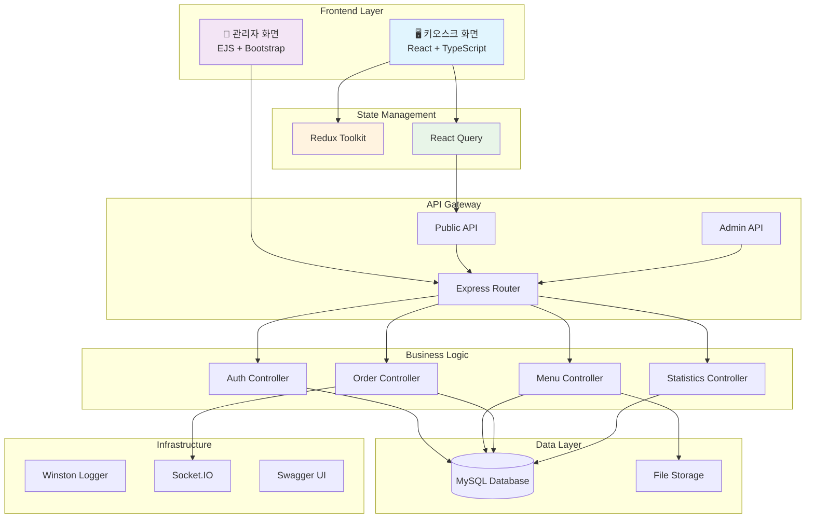
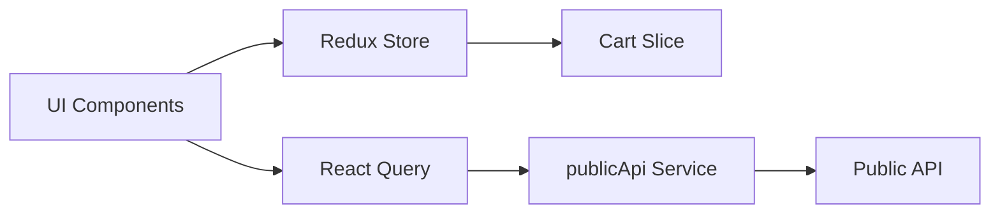

# 🍽️ AIOSK - 키오스크 풀스택 MVP

> **All-In-One Smart Kiosk** - 키오스크 주문/관리 흐름을 구현한 풀스택 MVP


---

## 📋 목차

- [🌟 프로젝트 소개](#-프로젝트-소개)
- [✨ 주요 기능](#-주요-기능)
- [🏗️ 시스템 아키텍처](#️-시스템-아키텍처)
- [🎨 프론트엔드](#-프론트엔드)
- [🚀 빠른 시작](#-빠른-시작)
- [📖 API 문서](#-api-문서)
- [🔧 환경 설정](#-환경-설정)
- [📁 프로젝트 구조](#-프로젝트-구조)
- [🧪 테스트](#-테스트)
- [🛠️ 운영 Runbook](#️-운영-runbook)
- [📊 모니터링 및 로깅](#-모니터링-및-로깅)
- [🛡️ 보안](#️-보안)
- [🤝 기여 가이드](#-기여-가이드)
- [📝 라이선스](#-라이선스)

---

## 🌟 프로젝트 소개

**AIOSK**는 레스토랑 키오스크 서비스를 위한 풀스택 MVP입니다.
React/TypeScript 기반 키오스크 화면, Express API, MySQL 모델, EJS 관리자 화면을 포함합니다.
현재 코드는 DB/API E2E, React/EJS 브라우저 E2E, 운영 runbook, GHCR image publish, SSH 기반 compose rollout, production preflight, 배포 중 DB migration 실행, smoke/heartbeat soak 스크립트, DB 백업/복구/retention/upload hook을 제공합니다. 운영 배포 전에는 실제 `.env.production` materialization, GitHub Actions deploy secrets, repository variable `FRONTEND_API_URL`, tokenized heartbeat 배포 시 optional `FRONTEND_KIOSK_STATUS_TOKEN`, 실제 secret manager/object storage/alert receiver credential, 운영 URL smoke/soak 실행 기록을 환경별로 확보해야 합니다.

### 🎯 **핵심 가치**

- **🧪 MVP 검증 상태**: 핵심 주문/관리 흐름은 DB/API E2E와 React/EJS 브라우저 E2E로 검증, 운영 URL 증거는 환경별 확보 필요
- **📱 키오스크 UI**: React + Material-UI 기반 주문 인터페이스
- **📈 구조화**: Express 라우트/컨트롤러/모델 기반 모듈 구성
- **🔒 보안**: JWT 인증, bcrypt 해싱, SQL 인젝션 방지
- **📊 모니터링**: Winston 기반 구조화된 로깅 시스템
- **📖 개발자 친화적**: Swagger UI를 통한 인터랙티브 API 문서

---

## ✨ 주요 기능

### 🔓 **공개 API** (키오스크용)

- 📋 카테고리 및 메뉴 조회
- 🛒 주문 생성 및 실시간 알림
- 📱 키오스크 화면용 최적화된 응답

### 🔐 **관리자 API**

- 👤 JWT 기반 인증 시스템
- 🍽️ 메뉴/카테고리 CRUD 관리
- 📦 주문 상태 관리 및 취소
- 📈 매출 통계 및 리포트 (CSV 내보내기)
- 📸 메뉴 이미지 업로드 시스템

### 📊 **고급 기능**

- ⚡ Socket.IO 실시간 알림
- 📋 다차원 통계 분석 (일별/시간별/카테고리별)
- 🖼️ Multer 기반 파일 업로드
- 🚨 중앙화된 에러 처리 및 로깅
- 📖 Swagger/OpenAPI 3.0 자동 문서화

---

## 🏗️ 시스템 아키텍처



---

## 🎨 프론트엔드

### 🛠️ **기술 스택**

- **프레임워크**: React 19.1.0 + TypeScript 5.8.3
- **빌드 도구**: Vite 6.x (HMR, 고속 빌드)
- **UI 라이브러리**: Material-UI (MUI) 7.1.2
- **상태 관리**: Redux Toolkit + React Query
- **라우팅**: `/`, `/kiosk` 정적 경로 렌더링
- **애니메이션**: Framer Motion 12.19.1
- **HTTP 클라이언트**: Axios 1.10.0

### 🖼️ **UI/UX 특징**

- **터치 친화적**: 대형 버튼 및 직관적 네비게이션
- **반응형 디자인**: 다양한 키오스크 화면 크기 지원
- **접근성**: ARIA 라벨 및 키보드 탐색 지원
- **애니메이션**: 부드러운 페이지 전환 및 인터랙션
- **모의 데이터**: 개발 서버에서 `VITE_USE_MOCK_DATA=true`로 명시한 경우에만 사용하며 production build/image에서는 거부

### 📱 **키오스크 화면 구성**

1. **카테고리 탐색**: 탭 기반 카테고리 선택
2. **메뉴 그리드**: CSS Grid 기반 메뉴 카드 레이아웃
3. **장바구니**: 실시간 수량 조절 및 가격 계산
4. **주문 완료**: 주문 확인 및 성공 피드백

### 🔄 **상태 관리 구조**



### 📊 **프론트엔드 현황**

- ✅ **키오스크 UI**: 핵심 주문 화면 구현
- ✅ **상태 관리**: Redux 장바구니 상태 + React Query API 상태 구성
- ✅ **개발 전용 명시적 모의 데이터 모드**: `VITE_USE_MOCK_DATA=true npm run dev` 설정 시 화면 흐름 확인 가능
- ✅ **프로덕션 빌드**: 통과
- ✅ **공개 API 정규화**: 백엔드 공개 API 응답을 키오스크 화면 타입으로 변환
- ✅ **실제 DB 연동 검증**: `npm run test:e2e`와 `npm run test:e2e:browser`로 MySQL 기반 API/브라우저 흐름 확인

### 🚀 **프론트엔드 실행**

```bash
# 프론트엔드 디렉토리로 이동
cd frontend

# 의존성 설치
npm install

# 개발 서버 실행
npm run dev

# 프로덕션 빌드
VITE_API_URL=http://localhost:3000 VITE_ALLOW_LOCAL_API_URL=true VITE_USE_MOCK_DATA=false npm run build
```

Frontend build env files are parsed as strict key/value data; malformed env line은 line number만 출력하고 Vite build 전에 실패합니다.

### 🌐 **접속 URL**

- **키오스크 화면**: http://localhost:5173 (포트가 사용 중이면 Vite가 터미널에 표시한 다음 포트)
- **개발 서버**: 자동 새로고침 지원
- **모의 데이터**: `VITE_USE_MOCK_DATA=true npm run dev`처럼 명시한 경우에만 사용

---

## 🚀 빠른 시작

### 📋 **시스템 요구사항**

- **Node.js**: 20.0.0 이상
- **MySQL**: 8.0 이상
- **npm**: 8.0.0 이상

### 📦 **설치**

```bash
# 프로젝트 디렉터리로 이동
cd AIOSK

# 의존성 설치
npm install

# 환경 변수 설정
cp .env.example .env
# .env 파일을 편집하여 데이터베이스 및 설정 정보 입력

# DB_NAME에 해당하는 database를 먼저 생성한 뒤 스키마 적용
mysql -u your_username -p -e "CREATE DATABASE IF NOT EXISTS kiosk_db CHARACTER SET utf8mb4 COLLATE utf8mb4_unicode_ci;"
CONFIRM_SCHEMA_APPLY=kiosk_db npm run db:apply-schema
# production compose env 기준으로 적용하는 경우
SCHEMA_ENV_FILE=.env.production CONFIRM_SCHEMA_APPLY=kiosk_db npm run db:apply-schema

# 관리자 계정 생성 또는 비밀번호 갱신
ADMIN_USERNAME=admin ADMIN_PASSWORD='change-this-password' npm run admin:create
# 비밀번호를 파일로 주입하는 경우
ADMIN_USERNAME=admin ADMIN_PASSWORD_FILE=/run/secrets/admin_password npm run admin:create
# production compose env 기준으로 생성하는 경우
ADMIN_ENV_FILE=.env.production ADMIN_USERNAME=admin ADMIN_PASSWORD='change-this-password' npm run admin:create
```

### ⚙️ **환경 변수 설정**

`.env` 파일을 생성하고 다음 정보를 입력하세요:

```env
# 데이터베이스 설정
DB_HOST=localhost
DB_USER=your_username
DB_PASSWORD=your_password
# 또는 DB_PASSWORD_FILE=/run/secrets/db_password
DB_NAME=kiosk_db
DB_PORT=3306

# JWT 설정
JWT_SECRET=your-super-secret-jwt-key-at-least-32-characters
# 또는 JWT_SECRET_FILE=/run/secrets/aiosk_jwt_secret

# 관리자 세션 설정
SESSION_SECRET=your-super-secret-session-key-at-least-32-characters
# 또는 SESSION_SECRET_FILE=/run/secrets/aiosk_session_secret
SESSION_STORE=memory
SESSION_CLEANUP_INTERVAL_MS=900000
SESSION_COOKIE_SECURE=false
SESSION_COOKIE_SAME_SITE=lax
TRUST_PROXY=0

# 서버 설정
PORT=3000
READINESS_DB_TIMEOUT_MS=2000
REQUEST_BODY_LIMIT=1mb
RATE_LIMIT_WINDOW_MS=60000
RATE_LIMIT_MAX_REQUESTS=300
AUTH_RATE_LIMIT_WINDOW_MS=60000
AUTH_RATE_LIMIT_MAX_REQUESTS=20
SHUTDOWN_TIMEOUT_MS=10000
CORS_ORIGIN=http://localhost:5173
SOCKET_CORS_ORIGIN=http://localhost:3000
KIOSK_FRONTEND_URL=http://localhost:5173
# API_PUBLIC_URL=https://api.example.com

# 로깅 설정
LOG_LEVEL=info
LOG_DIR=logs

# 파일 업로드 설정
UPLOAD_DIR=./uploads
MAX_FILE_SIZE=5242880
```

### 🏃‍♂️ **실행**

```bash
# 개발 모드 (nodemon 사용)
npm run dev

# 프로덕션 모드
npm start
```

서버가 성공적으로 시작되면:

- 🌐 **API 서버**: http://localhost:3000
- 📖 **API 문서**: http://localhost:3000/api-docs

---

## 📖 API 문서

### 🔗 **Swagger UI**

인터랙티브 API 문서는 서버 실행 후 다음 URL에서 확인할 수 있습니다:

**👉 [http://localhost:3000/api-docs](http://localhost:3000/api-docs)**

### 📋 **주요 엔드포인트**

#### ⚙️ **System**

```http
GET    /healthz                 # 프로세스 liveness 확인
GET    /readyz                  # DB 연결 포함 readiness 확인
GET    /metrics                 # Prometheus 텍스트 metrics
GET    /api                     # API index 및 문서/헬스 체크 링크
GET    /api-docs.json           # OpenAPI JSON
```

#### 🔓 **공개 API** (키오스크용)

```http
GET    /api/public/categories     # 카테고리 목록 조회
GET    /api/public/menus         # 메뉴 목록 조회 (카테고리별 필터링)
POST   /api/public/orders        # 주문 생성
POST   /api/public/kiosk/status  # 키오스크 상태 heartbeat 저장
```

#### 🔐 **관리자 API**

```http
POST   /api/admin/login          # 관리자 로그인
GET    /api/admin/orders         # 주문 목록 조회
GET    /api/admin/orders/:orderId        # 주문 상세 조회
PATCH  /api/admin/orders/:orderId/status # 주문 상태 업데이트
PATCH  /api/admin/orders/:orderId/cancel # 주문 취소
GET    /api/admin/statistics     # 종합 통계 조회
GET    /api/admin/statistics/sales # 매출 통계 조회
GET    /api/admin/statistics/top-menus # 인기 메뉴 통계 조회
GET    /api/admin/statistics/daily-sales # 일별 매출 조회
GET    /api/admin/statistics/hourly-analysis # 시간대별 주문 분석
GET    /api/admin/statistics/category-analysis # 카테고리별 매출 분석
GET    /api/admin/statistics/report # 통계 리포트 생성
GET    /api/admin/kiosks/status  # 키오스크 상태 조회
GET    /api/categories           # 카테고리 목록 조회
POST   /api/categories           # 카테고리 생성
GET    /api/categories/:id       # 카테고리 상세 조회
PUT    /api/categories/:id       # 카테고리 수정
DELETE /api/categories/:id       # 카테고리 삭제
GET    /api/menus                # 메뉴 목록 조회
POST   /api/menus                # 메뉴 생성
GET    /api/menus/:id            # 메뉴 상세 조회
PUT    /api/menus/:id            # 메뉴 수정
DELETE /api/menus/:id            # 메뉴 삭제
POST   /api/menus/:menuId/image  # 메뉴 이미지 업로드
```

#### 🖥️ **관리자 웹 UI**

- `/admin`: 매출/주문/최근 주문/키오스크 상태 요약
- `/admin/orders`: 주문 목록과 상태 변경
- `/admin/menus`: 메뉴 CRUD
- `/admin/categories`: 카테고리 CRUD
- `/admin/statistics`: 통계와 리포트 화면

### 📝 **API 테스트 가이드**

상세한 API 테스트 방법은 [`API_TEST_GUIDE.md`](./API_TEST_GUIDE.md)를 참조하세요.

---

## 🔧 환경 설정

### 🗄️ **데이터베이스 설정**

MySQL 데이터베이스를 생성하고 스키마를 적용하세요:

```sql
CREATE DATABASE kiosk_db CHARACTER SET utf8mb4 COLLATE utf8mb4_unicode_ci;
```

```bash
CONFIRM_SCHEMA_APPLY=kiosk_db npm run db:apply-schema
```

### 📁 **디렉토리 구조**

업로드된 파일과 로그를 위한 디렉토리가 자동 생성됩니다:

- `./uploads/` - 메뉴 이미지 저장
- `./logs/` - 애플리케이션 로그

---

## 📁 프로젝트 구조

```
AIOSK/
├── 📄 README.md
├── 📋 REQUIREMENTS.md          # 기능 요구사항 명세서
├── 📖 API_TEST_GUIDE.md        # 현재 API 테스트 가이드
├── 🛠️ OPERATIONS_RUNBOOK.md    # 운영 점검/장애 대응/rollback 절차
├── 🔐 ADMIN_ACCESS_GUIDE.md    # 관리자 접근/계정 생성 가이드
├── 🧹 ADMIN_ISSUE_RESOLUTION.md # 관리자 화면 정리 내역
├── 🔌 PORT_CHANGE_GUIDE.md     # 로컬 포트 변경 가이드
├── 📈 COMPLETION_REPORT.md     # 현재 완성도 보고서
├── 📌 PROJECT_STATUS_SUMMARY.md # 프로젝트 상태 요약
├── 📊 PROJECT_COMPLETENESS_AUDIT.md # 현재 완성도 및 prune 증거
├── 🧪 FRONTEND_TEST_REPORT.md  # 프론트엔드 테스트 보고서
├── 🗄️ database_schema.sql      # 데이터베이스 스키마
├── 🐳 Dockerfile
├── 🐳 docker-compose.yml
├── 🐳 docker-compose.prod.yml
├── 🐳 .env.docker.example
├── 🔧 .env.production.example
├── 📁 database/migrations/     # baseline 이후 SQL migration
├── 📁 deploy/systemd/          # 백업 timer 예시
├── 📁 monitoring/              # Prometheus/Alertmanager/Grafana 설정
├── 📁 scripts/                 # 검증, 배포, 백업, migration, smoke 스크립트
├── 📦 package.json
├── 🔧 .env.example
├── frontend/                   # 🎨 프론트엔드 (React + TypeScript)
│   ├── 📦 package.json
│   ├── 🐳 Dockerfile
│   ├── 🌐 nginx.conf
│   ├── 🔧 .env.example
│   ├── ⚙️ vite.config.ts
│   ├── 📝 tsconfig.json
│   ├── 🌐 index.html
│   ├── 📁 public/
│   └── 📁 src/
│       ├── 🚀 main.tsx          # 앱 진입점
│       ├── 📱 App.tsx           # 메인 앱 컴포넌트
│       ├── 📁 components/       # 재사용 가능한 컴포넌트
│       │   ├── ui/              # 기본 UI 컴포넌트
│       │   │   └── Button.tsx
│       │   ├── kiosk/           # 키오스크 전용 컴포넌트
│       │   │   ├── CategoryNav.tsx
│       │   │   ├── MenuGrid.tsx
│       │   │   ├── OrderReceipt.tsx
│       │   │   └── ShoppingCart.tsx
│       ├── 📁 pages/            # 페이지 컴포넌트
│       │   └── KioskPage.tsx
│       ├── 📁 services/         # API 서비스
│       │   ├── api.ts           # 기본 API 설정
│       │   └── publicApi.ts     # 공개 API
│       ├── 📁 store/            # Redux 상태 관리
│       │   ├── index.ts
│       │   └── slices/
│       │       └── cartSlice.ts
│       ├── 📁 types/            # TypeScript 타입 정의
│       │   └── index.ts
│       ├── 📁 data/             # 모의 데이터
│       │   └── mockData.ts
│       └── 📁 utils/            # 유틸리티 함수
└── src/                        # 🔧 백엔드 (Node.js + Express)
    ├── 🚀 server.js             # 메인 서버 파일
    ├── config/
    │   ├── 🗄️ db.config.js      # 데이터베이스 설정
    │   ├── 📖 swagger.config.js  # Swagger 설정
    │   └── 📸 upload.config.js   # 업로드 런타임 설정
    ├── controllers/             # 비즈니스 로직
    │   ├── public/              # 공개 API 컨트롤러
    │   │   ├── category.controller.js
    │   │   ├── kioskStatus.controller.js
    │   │   ├── menu.controller.js
    │   │   └── order.controller.js
    │   ├── admin/               # 관리자 API 컨트롤러
    │   │   ├── kioskStatus.controller.js
    │   │   ├── order.controller.js
    │   │   └── statistics.controller.js
    │   ├── admin.controller.js
    │   ├── category.controller.js
    │   ├── health.controller.js
    │   ├── menu.controller.js
    │   └── webAdmin.controller.js
    ├── middleware/              # 미들웨어
    │   ├── 🔐 auth.middleware.js  # JWT 인증
    │   ├── csrf.middleware.js    # 관리자 form CSRF 보호
    │   ├── 🚨 error.middleware.js # 에러 처리
    │   ├── flash.middleware.js   # 관리자 flash message
    │   ├── 📊 logging.middleware.js # 로깅
    │   ├── rateLimit.middleware.js # API/auth 요청 제한
    │   └── 📸 upload.middleware.js # 파일 업로드
    ├── models/                  # 데이터 모델
    │   ├── 🗄️ db.js             # 데이터베이스 연결
    │   └── *.model.js           # 각종 모델
    ├── routes/                  # 라우터
    │   ├── public/              # 공개 API 라우트
    │   ├── admin/               # 관리자 API 라우트
    │   ├── admin.routes.js
    │   ├── category.routes.js
    │   ├── health.routes.js
    │   ├── menu.routes.js
    │   └── webAdmin.routes.js
    └── utils/
        ├── 📊 logger.js          # Winston 로거 설정
        ├── metrics.js            # Prometheus metrics
        ├── envSecrets.js         # *_FILE secret loader
        └── mysqlSessionStore.js  # MySQL-backed EJS 세션 store
```

---

## 🧪 테스트

### 🔧 **cURL 테스트 예시**

공개 주문 생성 요청은 `items` 1-100개를 받으며 각 항목은 `menuId` 1 이상 정수와 `quantity` 1-99 정수만 허용한다. 주문 금액은 서버가 현재 메뉴 가격으로 계산한다.

```bash
# 카테고리 조회
curl -X GET http://localhost:3000/api/public/categories

# 주문 생성
curl -X POST http://localhost:3000/api/public/orders \
  -H "Content-Type: application/json" \
  -d '{"items":[{"menuId":1,"quantity":2}]}'

# 관리자 로그인
curl -X POST http://localhost:3000/api/admin/login \
  -H "Content-Type: application/json" \
  -d '{"username":"admin","password":"<ADMIN_PASSWORD>"}'
```

### 🤖 **자동화 테스트**

루트 `npm test`는 `scripts/verify-static.js`로 JavaScript/EJS 기본 검사와 문서/라우트/OpenAPI/운영 계약 정적 검증을 실행합니다.

```bash
npm test
npm run deps:check
```

`npm run deps:check`는 root와 `frontend/` dependency 사용 여부를 검사한다. Root의 `bootstrap`, `bootstrap-icons`, `chart.js`는 JS import가 아니라 EJS 관리자 화면의 `/vendor/...` browser asset으로 제공되므로 depcheck ignore list에만 둔다.

실제 MySQL DB/API 흐름은 별도 스크립트로 검증합니다. 이 스크립트는 `DB_NAME`이 기본값 `aiosk_e2e`처럼 `aiosk_e2e*`로 시작할 때만 해당 DB를 drop/recreate 합니다. 다른 DB 이름을 의도적으로 reset해야 하는 제한 상황에서는 `E2E_ALLOW_UNSAFE_DB=1`을 명시해야 하며, 이 값은 `0` 또는 `1`만 허용합니다. E2E runner positional arguments fail before DB reset or server setup: `test:e2e`와 `test:e2e:browser`는 옵션을 env로만 받고, 잘못 붙은 positional argument는 DB reset이나 서버 기동 전에 usage로 실패합니다.

```bash
DB_HOST=127.0.0.1 DB_PORT=3306 DB_USER=root DB_PASSWORD=root DB_NAME=aiosk_e2e npm run test:e2e
```

`npm run test:e2e`는 `scripts/create-admin.js` 기반 관리자 생성, 공개 카테고리/메뉴/주문 생성, 키오스크 상태 heartbeat, 관리자 로그인, 카테고리/메뉴 CRUD, 주문 목록/상세/상태 변경, 통계 조회, 관리자 키오스크 상태 조회, MySQL `Sessions` 기반 EJS 관리자 세션 페이지 렌더링을 실제 MySQL과 Express 서버로 확인합니다.

브라우저 흐름은 Playwright Chromium으로 검증합니다. 이 스크립트는 Express와 Vite dev server를 띄우고, React 키오스크의 메뉴 선택/장바구니/주문 완료/DB 저장과 EJS 관리자 로그인/주문 상태 변경/카테고리·메뉴 생성/DB 반영을 확인합니다.

```bash
npx playwright install chromium
DB_HOST=127.0.0.1 DB_PORT=3306 DB_USER=root DB_PASSWORD=root DB_NAME=aiosk_e2e_browser npm run test:e2e:browser
```

GitHub Actions CI는 push/pull request에서 루트 정적 검증/audit, DB shell script syntax check, 프론트 lint/build/audit, MySQL 서비스 기반 DB/API E2E, 브라우저 E2E, migration smoke, Docker image build, Prometheus/Alertmanager/Grafana 설정 검증을 실행합니다. Release workflow는 `v*` tag 또는 수동 dispatch에서 publish 전 검증 후 GHCR backend/frontend image를 publish합니다. Deploy workflow는 수동 dispatch와 GitHub Environment를 통해 SSH 원격 compose rollout을 실행하며, 기본 `run_migrations=1`로 새 backend image의 `db-migrate.js up`을 전체 compose rollout 전에 실행하고 `run_smoke=1` 입력으로 배포 직후 읽기 전용 smoke를 실행할 수 있습니다.

운영 compose 배포 전에는 production preflight를 실행합니다. 실제 `.env.production` 기준으로 placeholder secret, 과도하게 열린 env 파일 권한, `SESSION_STORE=mysql`, session cleanup/cookie 설정, upload 경로/용량 설정, request body 크기 제한, API/auth rate limit, `COMPOSE_DB_NAME` safe identifier, compose service port `1..65535` 범위, open/wildcard/local CORS, `KIOSK_FRONTEND_URL`/`API_PUBLIC_URL` local address, `:latest` image, metrics token file 누락 또는 scrape token 불일치, offsite backup 미설정, noop Alertmanager receiver, compose config 오류를 검사합니다. `COMPOSE_DB_PASSWORD`, `COMPOSE_MYSQL_ROOT_PASSWORD`, `GRAFANA_ADMIN_PASSWORD`는 16자 이상 non-placeholder 운영 비밀번호여야 합니다. Backend app secret은 값 대신 `DB_PASSWORD_FILE`, `JWT_SECRET_FILE`, `SESSION_SECRET_FILE`, `KIOSK_STATUS_TOKEN_FILE`, `METRICS_TOKEN_FILE`로도 주입할 수 있으며, 같은 secret의 값과 `*_FILE`을 동시에 설정하면 시작 전에 실패합니다. Production compose의 DB service password는 `COMPOSE_DB_PASSWORD` 계약을 사용합니다. `*_FILE=/run/secrets/...` 값은 container 경로이고 preflight와 host-side Node CLI secret loader는 `AIOSK_SECRETS_DIR` 아래의 matching host file을 검사합니다. Production monitoring profile에서는 `METRICS_TOKEN_FILE=/run/secrets/metrics_token`을 사용해야 Prometheus도 같은 token file을 scrape에 씁니다. `NODE_ENV=production` 런타임도 DB env, `PORT` 범위와 운영 `PORT=0` 거부, strong secret, MySQL-backed admin session store, secure admin session cookie, metrics token/open-metrics 의도, public CORS/SOCKET/public URL, request body limit, rate limit 계약을 시작 전에 검증합니다.
`PREFLIGHT_ALLOW_*`와 `PREFLIGHT_VALIDATE_MONITORING` preflight 제어값은 모두 `0` 또는 `1`만 허용합니다.
`.env.production`의 malformed env line은 secret 값을 echo하지 않고 line number만 출력한 뒤 Docker 검사 전에 실패합니다.

```bash
chmod 600 .env.production
PREFLIGHT_ENV_FILE=.env.production npm run ops:preflight
```

배포 후에는 실제 서비스 URL을 대상으로 smoke 검증을 실행합니다. 기본 검사는 읽기 전용이며, 관리자 자격증명을 주면 JWT/API와 CSRF 기반 EJS session login/logout을 추가 확인하고, `SMOKE_RUN_WRITE=1`일 때만 임시 카테고리/메뉴/주문 생성 후 정리를 시도합니다. Smoke boolean flag인 `SMOKE_RUN_WRITE`와 `SMOKE_SKIP_ADMIN_SESSION`은 설정 시 `0`, `1`, `true`, `false`만 허용합니다. Smoke admin credential은 `SMOKE_ADMIN_USERNAME`/`SMOKE_ADMIN_PASSWORD`, `ADMIN_USERNAME`/`ADMIN_PASSWORD` 순서로 complete pair만 선택하며, 상위 tier의 partial pair는 하위 tier 값과 섞지 않고 네트워크 요청 전에 실패합니다.
Protected `/metrics`를 수동 smoke에서 검증하려면 `SMOKE_METRICS_TOKEN` 또는 `METRICS_TOKEN`을 전달합니다. `RUN_SMOKE=1` 배포 smoke는 배포 env 파일의 `METRICS_TOKEN` 또는 file-backed metrics token을 자동 전달합니다.

```bash
SMOKE_BASE_URL=https://api.example.com npm run ops:smoke
SMOKE_BASE_URL=https://api.example.com SMOKE_METRICS_TOKEN=<token> npm run ops:smoke
SMOKE_BASE_URL=https://api.example.com SMOKE_ADMIN_USERNAME=admin SMOKE_ADMIN_PASSWORD='<password>' npm run ops:smoke
SMOKE_BASE_URL=https://api.example.com SMOKE_ADMIN_USERNAME=admin SMOKE_ADMIN_PASSWORD='<password>' SMOKE_RUN_WRITE=1 npm run ops:smoke
```

키오스크 heartbeat의 지속 갱신은 별도 soak로 확인합니다. 기본값은 같은 `ops-heartbeat-soak` kiosk row를 5분 동안 10초 간격으로 갱신합니다. 운영 backend가 `KIOSK_STATUS_TOKEN`을 요구하면 React 키오스크 image도 matching `FRONTEND_KIOSK_STATUS_TOKEN`으로 다시 publish되어야 브라우저 heartbeat가 `x-kiosk-status-token` header를 전송합니다. 이 값은 frontend bundle에 포함되므로 강한 secret이 아니라 heartbeat용 lightweight shared gate로만 취급하되, backend/preflight/frontend release gate는 16자 이상, placeholder/공백 없는 값을 요구합니다. Soak admin credential은 `SOAK_ADMIN_USERNAME`/`SOAK_ADMIN_PASSWORD`, `SMOKE_ADMIN_USERNAME`/`SMOKE_ADMIN_PASSWORD`, `ADMIN_USERNAME`/`ADMIN_PASSWORD` 순서로 complete pair만 선택하며, 상위 tier의 partial pair는 하위 tier 값과 섞지 않고 네트워크 요청 전에 실패합니다.

```bash
SOAK_BASE_URL=https://api.example.com SOAK_KIOSK_STATUS_TOKEN=<token> npm run ops:heartbeat-soak
SOAK_BASE_URL=https://api.example.com SOAK_ADMIN_USERNAME=admin SOAK_ADMIN_PASSWORD='<password>' npm run ops:heartbeat-soak
```

---

## 🛠️ 운영 Runbook

배포 전 gate, 최초 DB 준비, 관리자 계정 생성, 관측 지점, 장애 대응, rollback 절차는 [`OPERATIONS_RUNBOOK.md`](./OPERATIONS_RUNBOOK.md)를 기준으로 합니다.

현재 저장소에는 Dockerfile, 로컬/production compose, GHCR image publish workflow, SSH 기반 remote compose deploy workflow, production GitHub Environment 승인 gate, GitHub Actions deploy secret/variable audit, release/deploy workflow guard, compose rollout 스크립트, 전체 rollout 전 `db-migrate.js up` 실행 경로, DB 백업/복구 스크립트, 백업 retention/upload hook/systemd timer 예시, SQL migration/rollback runner, backend app secret의 `*_FILE` 주입 경로, Prometheus/Grafana/Alertmanager 설정과 noop alert receiver 차단 preflight가 있습니다. Backend production image는 runtime 운영 스크립트만 복사하고 image 내부 npm script surface도 해당 명령만 노출합니다. 2026-05-30 재실행 기준 `choisimo/AIOSK`의 `production` Environment는 `choisimo` required reviewer와 `main` custom deployment branch policy로 감사 통과했습니다. 같은 재실행 기준 GitHub Actions repository/environment secrets와 repository/environment variables는 비어 있어 `DEPLOY_SSH_HOST`, `DEPLOY_SSH_USER`, `DEPLOY_SSH_PRIVATE_KEY`, repository variable `FRONTEND_API_URL` 설정이 남아 있고, backend `KIOSK_STATUS_TOKEN`을 쓰는 경우 optional `FRONTEND_KIOSK_STATUS_TOKEN` repository variable도 필요합니다. 실제 `.env.production` materialization, secret manager provider/credential, 외부 알림 receiver/credential, object storage provider CLI/credential 운영은 아직 환경별 작업입니다.

```bash
GITHUB_REPOSITORY=<owner>/<repo> GITHUB_ENVIRONMENT=production npm run ops:github-env:check
GITHUB_REPOSITORY=<owner>/<repo> GITHUB_ENVIRONMENT=production npm run ops:github-actions:check
docker compose --env-file .env.docker.example config
docker compose --profile monitoring --env-file .env.docker.example config
docker compose --env-file .env.production.example -f docker-compose.prod.yml config
SCHEMA_ENV_FILE=.env.production CONFIRM_SCHEMA_APPLY=kiosk_db npm run db:apply-schema
npm run db:migrate:status
MIGRATION_ENV_FILE=.env.production npm run db:migrate:status
BACKUP_ENV_FILE=.env.production npm run db:backup -- backups/kiosk_db.sql.gz
npm run db:restore:drill -- backups/kiosk_db.sql.gz
RESTORE_ENV_FILE=.env.production ALLOW_PRODUCTION_RESTORE=1 npm run db:restore -- backups/kiosk_db.sql.gz
DRILL_ENV_FILE=.env.production npm run db:restore:drill -- backups/kiosk_db.sql.gz
BACKUP_ENV_FILE=.env.production BACKUP_RETENTION_DAYS=14 BACKUP_MIN_KEEP=7 npm run db:backup
BACKUP_ENV_FILE=.env.production BACKUP_UPLOAD_COMMAND='rclone copy "$BACKUP_FILE" "remote:aiosk-backups/$BACKUP_DB_NAME/"' npm run db:backup
cp .env.production.example .env.production
# .env.production의 image tag와 secret 값을 수정한 뒤 실행합니다.
npm run deploy:compose
RUN_MIGRATIONS=0 npm run deploy:compose
SMOKE_BASE_URL=http://127.0.0.1:3000 npm run ops:smoke
SOAK_BASE_URL=http://127.0.0.1:3000 SOAK_DURATION_MS=300000 npm run ops:heartbeat-soak
DEPLOY_SSH_HOST=<host> DEPLOY_SSH_USER=<user> SSH_KEY_FILE=~/.ssh/aiosk_deploy_key AIOSK_BACKEND_IMAGE=ghcr.io/<owner>/aiosk-backend:v1.0.0 AIOSK_FRONTEND_IMAGE=ghcr.io/<owner>/aiosk-frontend:v1.0.0 npm run deploy:remote
DEPLOY_SSH_HOST=<host> DEPLOY_SSH_USER=<user> SSH_KEY_FILE=~/.ssh/aiosk_deploy_key AIOSK_BACKEND_IMAGE=ghcr.io/<owner>/aiosk-backend:v1.0.0 AIOSK_FRONTEND_IMAGE=ghcr.io/<owner>/aiosk-frontend:v1.0.0 RUN_MIGRATIONS=0 npm run deploy:remote
DEPLOY_SSH_HOST=<host> DEPLOY_SSH_USER=<user> SSH_KEY_FILE=~/.ssh/aiosk_deploy_key AIOSK_BACKEND_IMAGE=ghcr.io/<owner>/aiosk-backend:v1.0.0 AIOSK_FRONTEND_IMAGE=ghcr.io/<owner>/aiosk-frontend:v1.0.0 RUN_SMOKE=1 SMOKE_BASE_URL=https://api.example.com npm run deploy:remote
```

DB shell operation은 기본적으로 `.env`를 읽고, `SCHEMA_ENV_FILE`, `BACKUP_ENV_FILE`, `RESTORE_ENV_FILE`, `DRILL_ENV_FILE`로 production env 파일을 명시할 수 있습니다. 이 스크립트들은 `DB_*` 값을 우선 사용하고 production compose env의 `COMPOSE_DB_*` 값을 fallback으로 사용합니다. DB shell env files are parsed as literal key/value data; shell code와 command substitution은 실행하지 않고 malformed env line은 line number만 출력한 뒤 `mysql`/`mysqldump` 전에 실패합니다. Shell DB password와 Node CLI secret loader도 `DB_PASSWORD_FILE`을 지원하며 `/run/secrets/...` 값은 `AIOSK_SECRETS_DIR` 아래 host file로 해석합니다. `DB_PASSWORD`와 `DB_PASSWORD_FILE`을 동시에 설정하면 `mysql`/`mysqldump` 실행 전에 실패합니다. `DB_NAME`/`COMPOSE_DB_NAME`은 shell DB client 실행 전에 letters/numbers/underscores only identifier로 검증됩니다. Option-like backup/schema paths fail before DB shell work; 파일명이 `-`로 시작해야 한다면 `./-file.sql.gz`처럼 경로를 명시합니다. DB shell operation positional arguments fail before mysql clients: `db:backup`/`db:restore`/`db:restore:drill`/`db:apply-schema`는 지원 개수보다 많은 positional argument가 붙으면 `mysql`/`mysqldump` 실행 전에 usage로 실패합니다. `npm run db:backup`은 dump output을 temporary file에 먼저 쓰고 `BACKUP_VERIFY=1` gzip 검증 통과 뒤 최종 `.sql.gz` 경로로 move합니다. `BACKUP_UPLOAD_COMMAND`는 앞뒤 공백을 제거한 뒤 실행하며 blank 값은 `mysqldump` 전에 실패합니다. `BACKUP_VERIFY`, `ALLOW_PRODUCTION_RESTORE`, restore drill의 `ALLOW_UNSAFE_RESTORE_DRILL`은 `0` 또는 `1`만 허용하므로 오타가 안전 검증 skip으로 해석되지 않습니다. Frontend production build의 `VITE_ALLOW_LOCAL_API_URL`과 `VITE_USE_MOCK_DATA`는 `true` 또는 `false`만 허용합니다. Dump 또는 검증 실패 시 지정한 backup artifact를 남기지 않습니다. `npm run db:restore`도 `.sql.gz` archive를 `gzip -t`로 검증한 뒤에만 `mysql` restore stream을 시작합니다.

Operational verification entrypoints reject positional arguments before preflight or network work: `ops:preflight`, `ops:smoke`, `ops:heartbeat-soak`는 옵션을 env로만 받고, 잘못 붙은 positional argument는 env/compose/network 검사 전에 usage로 실패합니다.

Migration runner는 migration file load 단계에서 예상 형식 밖의 파일이나 하위 디렉터리를 거부하고, 모든 `*.up.sql`에 matching `*.down.sql`이 있으며 고아 `*.down.sql`이 없는지 확인합니다. `up`/`down` 실행 전에는 `SchemaMigrations` history를 현재 image의 migration files와 대조합니다. Checksum이 바뀐 `changed` migration이나 현재 image에 없는 `orphaned` applied row가 있으면 `migration history drift`로 실패하고 schema 변경을 시작하지 않습니다.

`npm run deploy:compose`와 `npm run deploy:remote`는 기본적으로 DB service를 먼저 기동하고 health/running 상태를 확인한 뒤 새 backend image에서 `db-migrate.js up`을 실행한다. 호환성이 이미 확인된 긴급 재기동처럼 migration 실행을 의도적으로 생략할 때만 `RUN_MIGRATIONS=0`을 사용하고, 배포 기록에 사유를 남깁니다. Deploy toggle인 `MONITORING_PROFILE`, `RUN_MIGRATIONS`, `RUN_SMOKE`와 local preflight bypass인 `SKIP_PREFLIGHT`는 모두 `0` 또는 `1`만 허용합니다. `SKIP_PREFLIGHT=1`이어도 local deploy는 env 파일의 malformed env line을 line number만 출력하고 Docker 명령 전에 실패합니다. Remote env is restored from backup after failed deploy attempts before remote rollout completion. deploy shell entrypoints reject positional arguments before local or remote actions: 배포 옵션은 positional argument가 아니라 env로만 전달하며, 잘못 붙은 인자는 docker/ssh 실행 전에 실패합니다. deploy remote SSH files fail before SSH commands: `SSH_KEY_FILE` 또는 `SSH_KNOWN_HOSTS_FILE`을 지정하면 읽을 수 있고 비어 있지 않은 파일이어야 하며, 잘못된 경로는 원격 명령 전에 실패합니다.

`RUN_SMOKE=1`은 `SMOKE_METRICS_TOKEN`이 없으면 배포 env 파일의 `METRICS_TOKEN` 또는 `AIOSK_SECRETS_DIR/metrics_token`을 읽어 protected `/metrics` smoke에 사용합니다.

---

## 📊 모니터링 및 로깅

### 📋 **로깅 시스템**

Winston 기반의 구조화된 로깅을 제공합니다:

```javascript
// 로그 레벨
- error: 에러 발생 시
- warn: 경고 상황
- info: 일반 정보 (기본값)
- debug: 디버그 정보
```

### 📁 **로그 파일**

- `./logs/error.log` - 에러 로그만
- `./logs/combined.log` - 결합된 로그
- `./logs/access.log` - HTTP 접근 로그

### 📊 **모니터링 대상**

- `/healthz`: DB와 무관한 프로세스 liveness
- `/readyz`: DB `SELECT 1` 기반 readiness, 실패 또는 `READINESS_DB_TIMEOUT_MS` 초과 시 503
- `/metrics`: HTTP request count/duration, process uptime/memory Prometheus metrics. Production runtime은 32자 이상의 `METRICS_TOKEN` 또는 `METRICS_TOKEN_FILE`을 요구하고, production preflight/monitoring profile은 Prometheus scrape를 위해 `METRICS_TOKEN_FILE=/run/secrets/metrics_token`을 요구합니다. Production Prometheus는 `monitoring/prometheus.secure.yml`로 같은 token file을 scrape에 사용합니다. 토큰 없는 노출은 `ALLOW_OPEN_METRICS=true`와 `PREFLIGHT_ALLOW_OPEN_METRICS=1`로 명시해야 합니다. `ALLOW_OPEN_METRICS`와 `ALLOW_OPEN_CORS`는 설정 시 `true` 또는 `false`만 허용합니다.
- HTTP 요청/응답 로깅
- 성능 메트릭 (응답 시간)
- 보안 이벤트 (로그인 실패 등)
- 에러 발생 및 스택 트레이스

로컬 monitoring profile:

```bash
docker compose --profile monitoring --env-file .env.docker.example up prometheus alertmanager grafana
```

- Prometheus: `http://localhost:9090`
- Alertmanager: `http://localhost:9093`
- Grafana: `http://localhost:3001`

---

## 🛡️ 보안

### 🔐 **인증 및 권한**

- **JWT 토큰**: 관리자 API 보호
- **bcrypt 해싱**: 패스워드 암호화
- **관리자 경계**: JWT 관리자 API와 EJS 관리자 세션 보호

### 🚨 **보안 기능**

- **SQL Injection 방지**: Prepared Statements 사용
- **XSS 방지**: 동적 HTML 삽입 경로 escape 및 EJS 출력 escape
- **CSRF 방지**: EJS 관리자 POST 요청 토큰 검증
- **파일 업로드 보안**: 파일 타입 및 크기 제한
- **Rate Limiting**: API와 관리자 로그인 반복 요청 제한

### 🔍 **보안 모니터링**

- 로그인 실패 추적
- 비정상적인 API 호출 감지
- 파일 업로드 오남용 방지

---

## 🤝 기여 가이드

### 📋 **기여 방법**

1. 이 저장소를 Fork합니다
2. 작업 범위를 설명하는 브랜치를 생성합니다 (`git checkout -b feature/admin-report-fix`)
3. 변경사항을 검증한 뒤 커밋합니다 (`git commit -m 'Fix admin report contract'`)
4. 브랜치에 Push합니다 (`git push origin feature/admin-report-fix`)
5. Pull Request를 생성합니다

### 📝 **코딩 스타일**

- ESLint 규칙 준수
- 기존 모듈 경계와 naming convention 유지
- API 계약 변경 시 Swagger/OpenAPI와 `API_TEST_GUIDE.md` 함께 갱신
- backend 런타임 오류는 구조화 logger로 남기고 secret/token/password 계열 값은 로그에 노출하지 않기
- 생성 산출물, 로컬 `.env`, 업로드/로그/백업 파일은 Git에 포함하지 않기

### 🧪 **테스트 가이드**

- 기본 검증: `npm test`, `npm run deps:check`
- frontend 변경: `cd frontend && npm run lint`, `cd frontend && VITE_API_URL=http://localhost:3000 VITE_ALLOW_LOCAL_API_URL=true VITE_USE_MOCK_DATA=false npm run build`
- DB/API/Admin 흐름 변경: `npm run test:e2e`
- React/EJS 브라우저 흐름 변경: `npm run test:e2e:browser`
- 운영 shell/deploy 변경: `npm run db:backup:check`와 관련 runbook smoke/preflight 확인

---

## 📈 로드맵

### 🚧 **현재 버전 (v1.0)**

- MVP 핵심 주문/관리 흐름 구현 및 자동 E2E 검증 연결
- DB/API E2E, React/EJS 브라우저 E2E, 운영 runbook 추가
- Swagger 기반 API 문서화 제공

### 🔎 **다음 완료 기준**

- 실제 `.env.production`을 materialize하고 production preflight 통과 기록 확보
- GitHub Actions deploy secrets와 repository variable `FRONTEND_API_URL` 설정
- tokenized heartbeat 배포 시 optional `FRONTEND_KIOSK_STATUS_TOKEN` 설정
- 실제 secret manager/object storage/alert receiver credential 준비
- 운영 URL에서 `npm run ops:smoke`와 `npm run ops:heartbeat-soak` 실행 기록 확보

---

## 🆘 문제 해결

### ❓ **자주 묻는 질문**

**Q: 서버가 시작되지 않아요**
A: `.env` 파일의 데이터베이스 설정을 확인하고, MySQL 서버가 실행 중인지 확인하세요.

**Q: 파일 업로드가 실패해요**
A: `uploads/` 디렉토리의 권한을 확인하고, 파일 크기가 5MB를 초과하지 않는지 확인하세요.

**Q: API 문서가 보이지 않아요**
A: 서버 실행 후 `http://localhost:3000/api-docs`에 접속하세요.

### 🔧 **디버깅**

로그 파일을 확인하여 상세한 에러 정보를 얻을 수 있습니다:

```bash
tail -f ./logs/error.log
```

---

## 📞 지원

현재 확인 가능한 지원 문서는 로컬 API 문서입니다.

- 📖 **문서**: [API 문서](http://localhost:3000/api-docs)

---

## 📝 라이선스

이 프로젝트는 **ISC 라이선스** 하에 배포됩니다. 자세한 내용은 [LICENSE](LICENSE) 파일을 참조하세요.

---

## 🙏 감사의 말

AIOSK 프로젝트를 만들어주신 모든 기여자분들께 감사드립니다.

**핵심 기술 스택:**

- [Express.js](https://expressjs.com/) - 웹 프레임워크
- [MySQL2](https://github.com/sidorares/node-mysql2) - 데이터베이스
- [Socket.IO](https://socket.io/) - 실시간 통신
- [Winston](https://github.com/winstonjs/winston) - 로깅
- [Swagger](https://swagger.io/) - API 문서화
- [JWT](https://jwt.io/) - 인증
- [Multer](https://github.com/expressjs/multer) - 파일 업로드

---

<div align="center">

**AIOSK - 키오스크 풀스택 MVP**

[](https://nodejs.org/)
[](https://www.mysql.com/)
[](https://expressjs.com/)

</div>
